#  Data Types, Variables, Arrays (120 mins)


<!-- ID NEEDED: Can you add these in based on topics below? -->
| Timing | Type | Topic |
| --- | --- | --- |
| x min | [Introduction](#introduction) | Topic |
| x min | [Demo/Codealong](#demo) | Topic |
| x min | [Guided Practice](#guided-practice) | Topic |
| x min | [Independent Practice](#ind-practice) | Topic |
| x min | [Conclusion](#conclusion) |Topic |

### LEARNING OBJECTIVES
*After this lesson, you will be able to:*
- Describe the concept of a 'data type' and how it relates to variables
- Describe use cases of different 'data types'
- Declare, assign to, and manipulate data stored in a variable
- Describe how arrays are used to store data
- Manipulate values in an array
- Practice proper JS syntax and semantic variable naming.

### STUDENT PRE-WORK
*Before this lesson, you should already be able to:*
- Break down simple coding problems using pseudocode
- Have basic understanding of Javascript
- Be comfortable with a text editor


<!-- NOTE FROM SARAH - Having trouble fitting all this content into 120 minutes. Going to see what I can move around. -->


---
<a name="opening"></a>
## Opening (10 mins)
- Review pre-work, projects, or exit ticket, if applicable
- Review current lesson objectives

Variables are used to store data types into the memory of the computer so that they can be referenced later.

Think of them as special containers that can hold information for you.

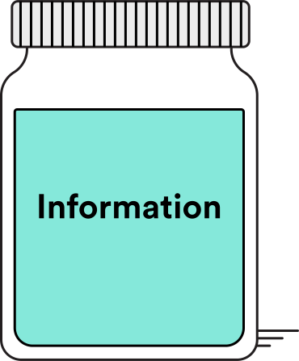

#### Always use var!

In order to use a variable in JS, you must announce that you want to use it.

You make this announcement by using the keyword `var` and declaring a variable name next to it.

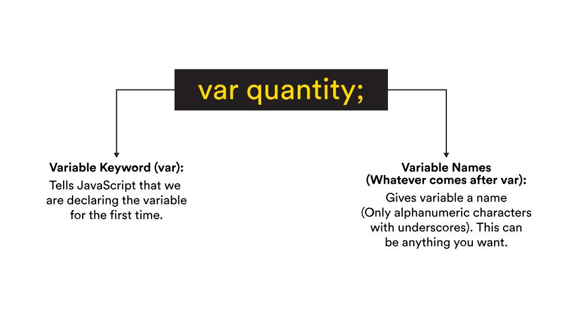

Note: There must be a space after the keyword var.

Now that we've declared our variable names, we need to give them values.

If you declare a variable without assigning any value to it, its type is `undefined`.

```javascript
var name;
=> undefined
```

So lets try assigning a value to variable:

```javascript
var name = 'Santa';
=> undefined

name
=> 'Santa'
```
Notice that the value is a word (not a number), so we put quotation marks around it.

We always put quotation marks around strings (values that consists of letters and/or other characters). We'll be talking about strings later in this lesson.

#### Variable Syntax

Notice the space before and after the = sign and the semicolon after the string.

Making sure these are in place is a good habit to develop and will be important for when your code gets more complicated later on.

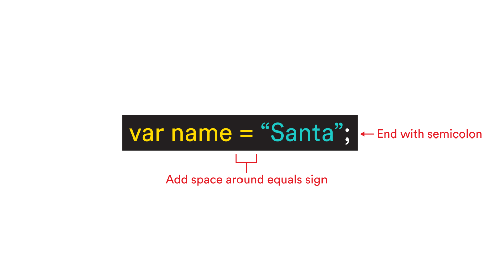

JS is a programming language, and like any language it has its own grammar and rules of operation. Let’s look at four rules of thumb:

1. When creating/declaring a variable for the first time, use the var keyword.
2. Variable names should be written in camelCase
2. Add a space before and after the equal sign =.
3. Statements need to end with a semicolon ;


Note that in JavaScript, the equal sign doesn't evaluate things the way it does in math; rather, it assigns values to things, like variables. We call this an _assignment operator_.


#### Reassigning Variables
JavaScript runs synchronously and top-down, meaning it updates itself to the latest information given (on the bottom).

So the values we give our variables furthest down will become our new values at the end.

Let's take a look at a brief example. Say that we want to create variables for a character's name, age and location.

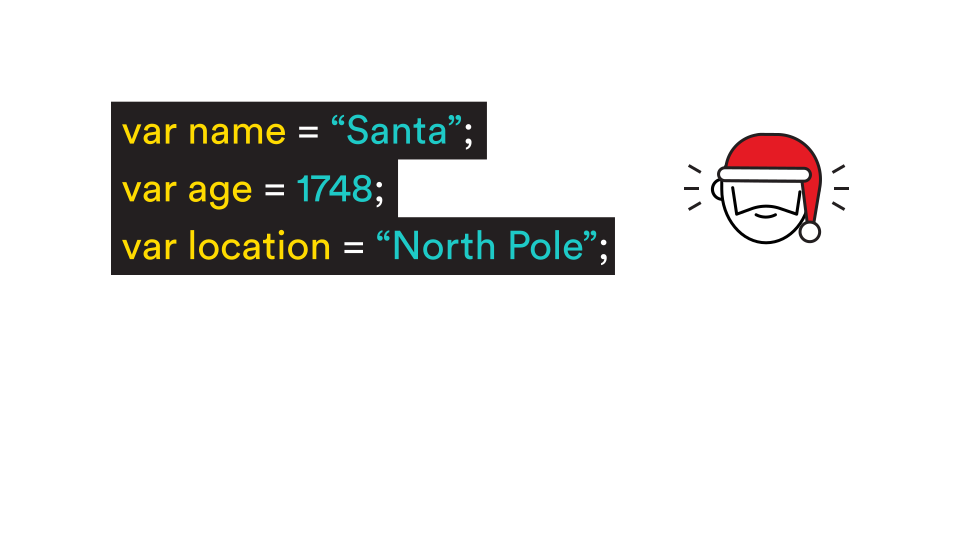

We can later replace, or reassign, the values of these variables like so:

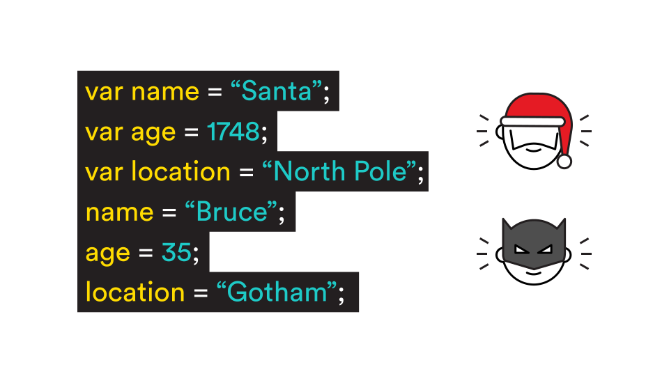

Here's a brief [video](https://generalassembly.wistia.com/medias/66kaqbwoc1) summarizing how to assign and reassign variables.


***

## Data Types Intro (5 mins)

We briefly mentioned earlier that you can add different types of values to JS variables. JS knows when you are using letters and when you are using numbers.

This will be handy later on when you start combining words or adding numbers together in your code. For now, it’s important to know that these distinctions are called data types.


_In computer science and computer programming, a data type or simply 'type' is a classification identifying one of various types of data that determines the possible values for that type, the operations that can be done on values of that type, the meaning of the data, and the way values of that type can be stored._  

Data types are really similar across different languages.

What this means is that being confident in working with these concepts critically will enable you to walk into any programming language with some base knowledge that is translatable.


We'll elaborate on all of these - except Booleans, for now. We'll talk about how they behave in JavaScript, show you some helper methods to work with each type, and then practice these helper methods to manipulate data using JavaScript.

***
## Guided Practice: Data Types (15 mins)

#### Chrome's Developer Console

For the exercises in this lesson, we suggest you use the Google Chrome Developer Tool Console by following these steps:

Open up Google Chrome in a separate window (and place it next to the window with this slideshow).
Right click anywhere on the browser and click on "Inspect."
In the new "Elements" window that appeared, click on "Console" on the top menu.

>Perform the following steps in the console:
1. Declare a variable called legs with the value 4.
  Note: the console returns undefined when declaring a variable using var because the var statement returns no value. This will be the case for every var declaration.
2. Declare variables for the traits color and sound (using quotations for string values).
3. Update values for each variable. No need to use var this time!
  To check the value of our variable legs, simply type legs; and press enter. Repeat for the other two variables.


> Check: Make sure students have typed in the correct statements

#### Loosely Typed Language

Notice that in JavaScript, you do not need to declare what type of data you are using.

For example, when you code:

```
var a = 13;
var b = "thirteen";
```

JS will know that var a is a number and that var b is a string because strings always have quotation marks. Using quotation marks is a way of communicating with the processor what type of data to expect.

In Java, a different programming language, you do have to declare the type of values when you code in the following way:

```
int a = 13;
string b = "thirteen"
```


JavaScript is a loosely typed language. As we mentioned before, this means that there is no need to specify the data type (string, number, etc.) you are using.

A strongly typed language is one that you must explicitly say the type of variable you're declaring (like Java).

While a loosely typed language reduces the amount of code you must write, it increases the possibility of type errors, when a value is not of the expected data type.

For example, if you put quotations marks around a number, like so `"9"`, the processor will read it as a string. You should always be mindful of the type of data you use moving forward.

#### typeof()

When we start writing more complex code, there may be times when we forget which type of data we’re manipulating.

Luckily, the computer already knows which type of data we're working with, so we can use the `typeof()` command in the console to find out.

`typeof()` returns a string that tells us which type of data we’re seeing.

Take a look at some examples:

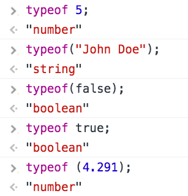

Notice how we can choose whether or not to use the parenthesis.

For consistency’s sake, it’s a good idea to pick one way and stick with it.

Make sure to remember the typeof() command in case you ever need to find out the type of data with which you are working.


>Exercise: Perform the following steps in the console:
1. typeof 'hello';
  The console returns 'string'.
2. typeof 24;
  The console returns 'number'.
3. typeof (3.45);
  The console returns 'number'.
4. typeof true;
  The console returns 'boolean'.
5. typeof ("JS is fun!");
  The console returns 'string'.

> Check: Make sure students have filled in the correct input

***
## Strings and Numbers (5 mins)

Strings are collections of letters and symbols known as *characters*, and we use them to deal with words and text in JavaScript. Strings are just another type of **value** in Javascript.

```
'John'
'Jane'
'123'
```

> Instructor note: Demo for students in your console the difference between double quotes vs single quotes and when to use each.

#### Numbers

In JavaScript, numbers can always be divided into two groups:

Integers (whole numbers)

```
   ..., -1,0, 2, 3, 4, 5, ...
```

Floats (decimals)
```
2.718, 3.14, .5, .25, etc
```

This means that JS numbers can be positive, negative, or have a decimal point.

<!-- @sarahholden Exercise: Ask node for the typeof() a whole number and then a decimal -->


***
## Guided Practice: Arithmetic Operators (15 mins)

In this section we'll be talking about expressions. What are expressions? Watch this [video](https://generalassembly.wistia.com/medias/e1c21pib0n) to find out:

How do we combine numbers and operators to come up with more complex expressions in JS?

It’s simple — we use arithmetic operators.

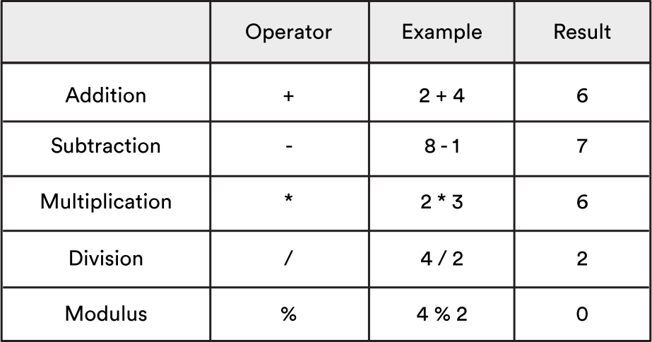

All of the standard arithmetic operators learned in grade school (addition, subtraction, division, and multiplication) are supported in JS. These should look familiar.

But if you don’t have a background in programming, that last operator — the modulus operator — might be new.

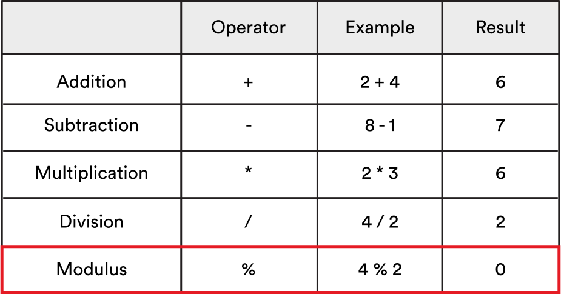

The modulus operator shows the remainder of a division problem.

For example, 9 divided by 4 equals 2 with a remainder of 1. The modulus operator takes two numbers as inputs and returns what's leftover from the division.

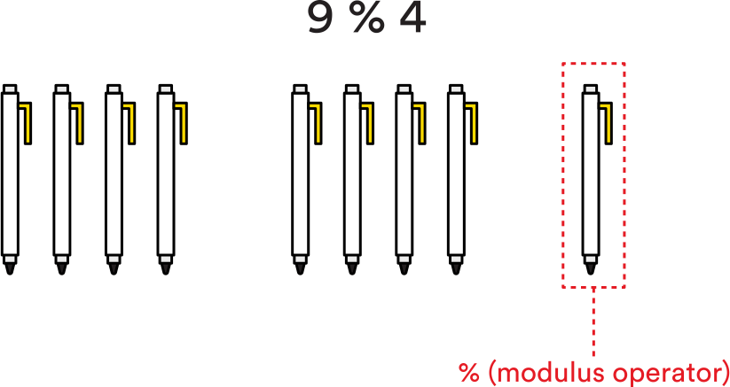

The modulus operator % is particularly useful in programming if we want to find out if a number is even or odd.

If we divide by 2 and have a remainder of 1, we know the number is odd. If we have a remainder of 0, then we know that the number is even.

Let’s look at some examples:

Odd numbers:
```
5 % 2 = 1
7 % 2 = 1
```

Even numbers:
```
4 % 2 = 0
2 % 2 = 0
```

This may seem tedious now, but it’ll come in handy later on.


<!--
ID NEEDED: Would you be able to format the following exercise? Thanks!

Exercise:
1 + 2
The console returns 3
2 - 5
The console returns -3
5/2
The console returns 2.5
6*2
The console returns 12
10%4
The console returns 2 -->

***
## Guided Practice: String Concatentation and Coercion (15 mins)

Now, let’s see how you can use string values (textual information) in JS.

When given string values, the + operator actually behaves differently — it concatenates, or combines, two strings together to make one big string.

Take a look in this brief [video](https://generalassembly.wistia.com/medias/rysrb53amn).

As you can see, putting single or double quotation marks around a value turns it into a string. (Again, don't worry about the console.log() command for now).

So, even though both “4” and “3” look like numbers to us humans, JS sees that they’re in quotation marks and therefore treats them as strings.

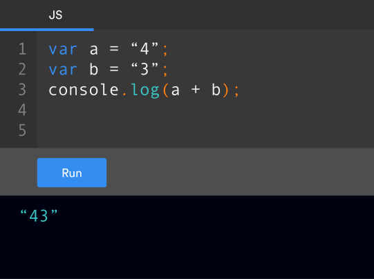


Using the + operator to put the two strings together literally puts them next to each other, instead of evaluating their total.

This is called concatenation (when strings are glued together).

Here's another example of concatenation.

JS glued the two strings together, but do you notice anything wrong?

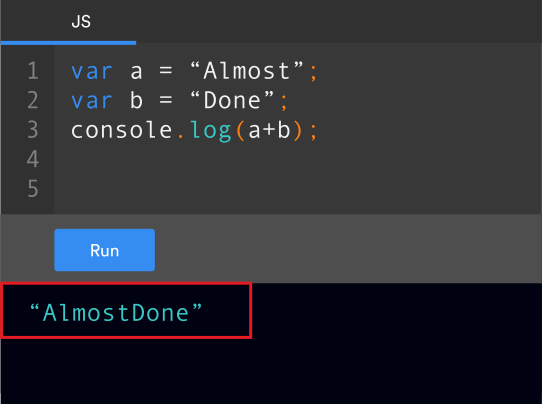

There is no space between the two words!

This is because we didn’t add the spaces in ourselves. It's just one of many reasons why we have to carefully watch our spacing and grammar.

To fix this, we’ll have to add in the space ourselves.
We can either insert it after the string "Almost"or before the string "Done".

Here, we added a space after "Almost ".

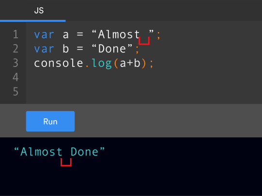

Developing good habits like adding spaces before and after the equal sign and putting quotation marks around strings will help you minimize mistakes.

It also helps you easily find errors as your code becomes more complicated in the future.

Another good habit to help you avoid coding headaches: mind your syntax.

Here are some syntax rules that are crucial to keep in mind:

1. JS is case sensitive

  For example: numberofstudents is not the same as numberOfStudents, which is not the same as NuMbErOfStUdEnTs.

  When you want to use a variable name consisting of several words, you will get an error if you have spaces between the words. Instead, you can combine all the words together into one long variable name. The first letter in this variable name should be lowercase, and then the first letter in each word that follows should be uppercase. This is called camelcase (see how it resembles a camel with humps)?

  Here's another example:
  var camelsAreAwesome = true;

2. End statements with a semicolon ;

  x = x + 1;

  After each line of instruction, be sure to use a semicolon. Although you may be able to get away without using semicolons in some browsers, JavaScript often does nasty things when it guesses where to put semicolons itself. It’s better to be explicit and tell the interpreter exactly where a statement should end.

3. Use // for comments

  Developers often use comments to make notes for themselves and other developers. You can use a comment to add in content that will be ignored by the interpreter but can be read by anyone looking through the code.

  To add a comment, begin a line with two forward slashes //. This is an example of a great use case for pseudocode.

  Example:
  ```
  var x = 10; //decare variable x first
  var y = 5; //then declare y
  x + y //add the two variables
  ```

4. Surround strings with quotations " "

  Any time you have textual information, surround strings with single or double quotation marks ( 'JS is fun', "O’Doyle rules!" ). Also, use single or double quotation marks when you want numbers to function as strings (as we did in the "4" + "3" = "43" example).


***ES6 Syntax***
The newest version of ES6 gives us a more elegant pattern called string interpolation using a new datatype called `string templates`

Rather than single quotes we use back ticks \`\`

```javascript
var firstWord = 'hello'
var secondWord = 'world'

`${firstWord} ${secondWord}`
=> 'hello world'
```

> Exercise: Take a few minutes to concatenate strings in your console using both the `+` method and using string templates \`\` and string interpolation `${}`


***
## Guided Practice: Assignment Operators (10 mins)

Now, let’s get back to some math and look at assignment operators.

You're already familiar with the = assignment operator, but there are also ones we can use to add or subtract value from a variable. Take a look:

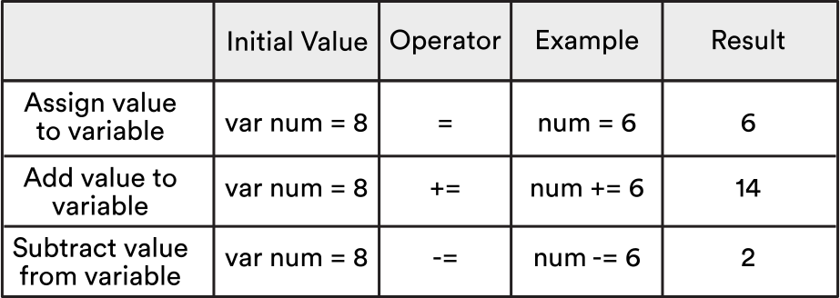

The += operator adds value to an existing variable.

The -= operator subtracts value from an existing variable.

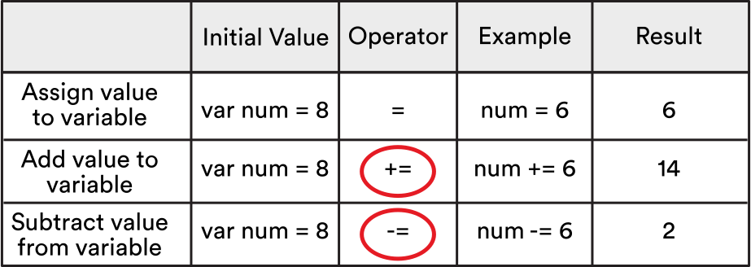

There are also a couple arithmetic operators we can use to add or subtract one from the value of a variable:

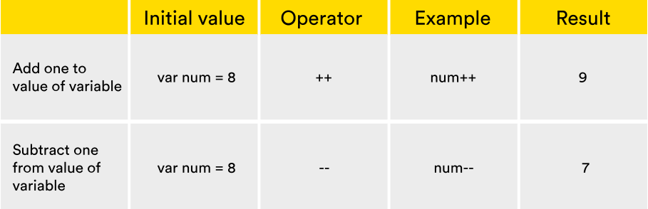

<!-- ID NEEDED: Can you format this exercise?
Type var num = 10;
Note: the console returns undefined when declaring a variable using var because the var statement returns no value
Now, type num += 4;. What do you think the value of num will become?
Note: the console returns 14 because our value was 10 and we added 4 to it.
Type num -= 8; the console. Before you press enter, take a moment to think about what value the console will return.
Note: the console returns 6 since the new value was 14 and we subtracted 8 from it.
-->


***
## Guided Practice: Special arithmetic methods (10 mins)

Apart from simply adding and subtracting numbers from variables, JavaScript also allows you to use special code to perform other arithmetic operations on numbers, such as finding the square root.

Some of this code will contain a dot `.`. We will cover the dot notation in more depth in a later lesson, but, for now, let’s practice with some of the simpler arithmetic methods.


> Check: Take 5 minutes to look at the Math documentation (link is below) and pick a function to quickly explain to the class. We'll popcorn around the room each person will get 30 seconds to explain what their function is/does. Don't worry if you chose the same one as someone else. Repetition leads to retention!
https://developer.mozilla.org/en-US/docs/Web/JavaScript/Reference/Global_Objects/Math

Type the following code into the Chrome Developer Tools Console:

*  Need to take a number to a specific power? Then just use Math.pow().

```
// 3^2 becomes
Math.pow(3,2)
=> 9

// 2^4 becomes
Math.pow(2,4)
=> 16
```


* Taking a square root of a number? Then use Math.sqrt().

```
// √(4) becomes
Math.sqrt(4)
=> 2
```

* Need a random number? Use Math.random().

```
// The following only returns a random decimal
Math.random()
=> .229375290430
/*
The following will return a
random number between 0 and 10
*/
Math.random()*10

```

* Since Numbers can be **Floats** or **Integers** we often want to get rid of remaining decimal places, which can be done using `Math.floor`.

```
// Remove the decimal
Math.floor(3.14)
=> 3
Math.floor(3.9999)
=> 3

```

While it may seem like we’ve covered a lot of math in this section, don't worry — you're not going to be doing any calculus in this course.

When it comes down to it, computers operate on a pretty simple and straightforward logic, and there will be many times that you'll solve a problem by using one of these basic mathematic principles.


***
## Guided Practice: Helper Methods (15 mins)

#### String helper methods

To find the length of a string, access its [`length`](https://developer.mozilla.org/en-US/docs/Web/JavaScript/Reference/Global_Objects/String/length) property:

```
'hello'.length;
=> 5
```

Strings have other [methods](https://developer.mozilla.org/en-US/docs/Web/JavaScript/Reference/Global_Objects/String#Methods) as well that allow you to manipulate the string and access information about the string:

```
'hello'.charAt(0);
=> 'h'

'hello, world'.replace('hello', 'goodbye');
=> 'goodbye, world'

'hello'.toUpperCase();
=> 'HELLO'
```

#### Converting Strings to Integers with parseInt() and parseFloat()

You can convert a string to an integer using the built-in [`parseInt()`](https://developer.mozilla.org/en-US/docs/Web/JavaScript/Reference/Global_Objects/parseInt) function. This takes the base for the conversion as an optional second argument, which you should always provide:

```javascript
parseInt('123');
=> 123

parseInt('010', 10);
=> 10
```

This will be important later when we're taking user input from the web or from the command line and using it on our server or in our browser to do some type of numeric calculation.

Similarly, you can parse floating point numbers using the built-in [`parseFloat()`](https://developer.mozilla.org/en-US/docs/Web/JavaScript/Reference/Global_Objects/parseFloat) function which uses base 10 always unlike its `parseInt()` cousin.

```javascript
parseFloat('11.2');
=> 11.2
```

You can also use the unary `+` operator to convert values to numbers:

```javascript
+'42';
=> 42
```

>EXERCISE: Let's take five minutes to use parseInt() and parseFloat() in the console.

#### NaN

The `parseInt()` and `parseFloat()` functions parse a string until they reach a character that isn't valid for the specified number format, then return the number parsed up to that point. However the '+' operator simply converts the string to `NaN` if there is any invalid character in it.

A special value called [`NaN`](https://developer.mozilla.org/en-US/docs/Web/JavaScript/Reference/Global_Objects/NaN) (short for 'Not a Number') is returned if the string is non-numeric:

Username example:
```javascript
parseInt('colin1990');
=> NaN

parseInt('1990colin');
=> 1990
```

You can test for `NaN` using the built-in [`isNaN()`](ttps://developer.mozilla.org/en-US/docs/Web/JavaScript/Reference/Global_Objects/isNaN) function:

```javascript
isNaN(NaN);
=> true
```


#### Null and Undefined

JavaScript distinguishes between:

- `null` a value that indicates a deliberate non-value
- `undefined` that indicates an uninitialized value — that is, a value hasn't even been assigned yet


#### Converting Numbers to Strings

* If you want to turn a number into a string you can use a helpful method called `toString`.

```javascript
(1).toString()
=> '11'
/**
be careful though,
since numbers can be floats
javascript might
misunderstand you.
*/
1.toString()
=> Float Error
// but the following works
1..toString()
```


***
## Intro to Arrays (15 mins)

Arrays — what are they, and what are they good for?

Watch this [intro video](https://generalassembly.wistia.com/medias/upd8qxyabg) to find out!

As you learned in the intro video, variables cannot hold multiple values, so we use arrays when we want to use more than one value at once.

Unfortunately, strings and numbers are not enough for most programming purposes.
What is needed are collections of data that we can use efficiently -- Arrays.

Take a look at this [video](https://generalassembly.wistia.com/medias/uey023vfx6) that provides an overview of how we can work with arrays.

Said another way, an array is an ordered list of items — also known as elements — separated by commas and situated between brackets [ ].


Arrays are data structures, similar in concept to lists. For example:

``` js
var animals = ["cat", "dog", "cow", "chicken"];
var age = [24, 11, 55];
```

They usually contain the same kind of data, and, in JavaScript, they can dynamically grow and shrink in size.

Arrays can also contain different types of data, such as:

``` js
var stuff = ["red", 42, "gorilla", false];
```

However, we generally use arrays to deal with elements of the same data type.


Arrays help us make the most out of our elements, allowing us to:

- Reorder elements.
- Identify the value of one element in the list by specifying its position.
- Go through the list item-by-item and manipulate each element.

#### Working with Arrays

Before we dive deeper into arrays, let’s learn a little about indexes.

Items in an array are stored in sequential order. Each element has an index, a number that tells us the position in the array where the element can be found.

Indexes allow you to access and update array values.

Take a look at this grocery list. Do you notice anything interesting about how these items are numbered?


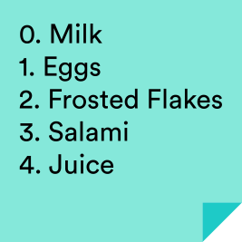

You may have noted that the numbers start at 0 instead of 1.

JavaScript, like many programming languages, is zero-based, meaning that its numbering starts at 0 instead of 1.

So, when we start assigning index values to an array, the first position in the array will be [0], the second will be [1], and so on.

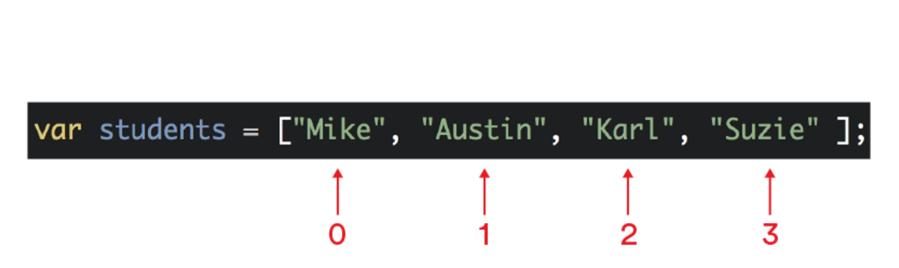


#### Recap
Let’s review everything we know about arrays so far:

We typically create an array using a list with the same type of values. Here, we are using strings only.

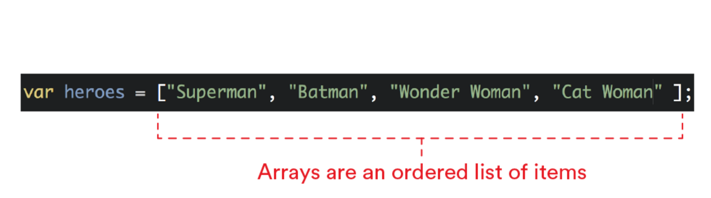

We declare arrays the same way we declare variables.

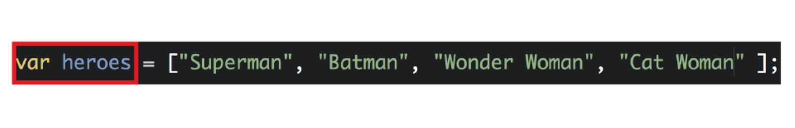

Each item is called an element. They are separated by commas and situated between square brackets.

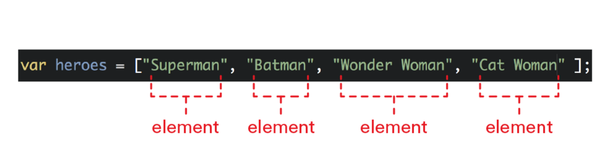

The index is the number that tells us the position of an element in an array. It always starts with the number 0.

Our friend Batman from Lesson 2 can be found at index 1

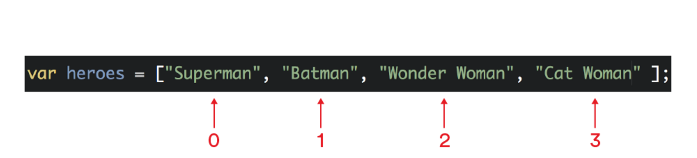

> Exercise: Open the console in Chrome and do the following:
1. Declare a variable called villains and assign it an array with the following strings: Cruella, Ursula, Jafar, Captain Hook.
2. Don't forget single or double quotation marks around your strings and a semicolon at the end of your array.
3. Now type villains and press enter.

Does your array look like this?

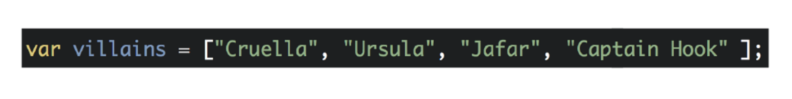

Now, which villain is in index 3?


Because the index starts at 0, index 3 is Captain


> Note: an alternate way to declare arrays is by using the JS keyword `new`
```javascript
var a = new Array();
=> undefined
```


***
## Accessing and updating elements in an array (15 mins)
#### Getting data from an array

To access, or retrieve, a value from an array, we will use the array name, followed by an index number, wrapped in square brackets.

Let’s take a look at some examples.

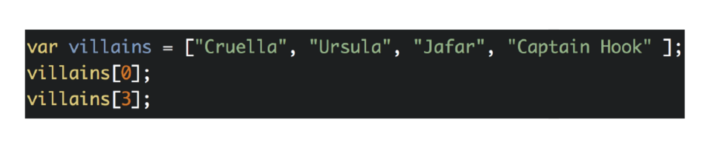

The first code is accessing index 0, so it should return “Cruella.”

The second code is accessing index 3, so it should return “Captain Hook.”


Bonus: Can you come up with a way of asking for a random index (whole number) between zero and the length of your array? HINT: Math.random and Math.floor

#### Adding a new value to an array

To add a new value to the array, specify the index number of the position where the new value should be added.

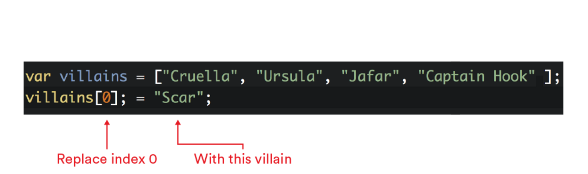

We should now have a new list (Cruella is replaced with Scar):

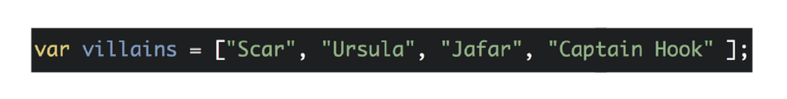


<!--
ID NEEDED: Can you format the following exercise?
Create an array of villains again, with the same list of villains (Cruella, Ursula, Jafar, Captain Hook).
Now replace Cruella with Scar, using the correct index number (remember indexes start at 0 in JS).
Note: the console returns 'Scar' because that is the newest value that was added to the array.
Add an additional villain 'Maleficent' at the end of the array using the correct index number.
Note: the console returns the newest value that was added.

Now, type villains and press enter. Does your console look like this?

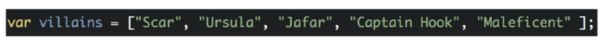

-->

***
## Array Deep Dive (20 mins)

#### Length method

Now, let’s look at length property. All arrays have a property called length, which tells you how many elements the array contains.

To access this value, simply tack on .length to the end of an array (or, alternatively, a variable containing that array). Here are some examples of .length in action:

``` js
['a', 'b', 'c'].length;  // Evaluates to 3

var x = [10, 20, 30, 40];
x.length; // Evaluates to 4
```


One helpful part of knowing the length of an array is that it allows us to easily find the last (or second-to-last, or third-to-last, etc.) element.

Because the first element in an array always has an index of 0, the index of the last element will be equal to the length of the array minus one.

``` js
var team = ['ted', 'lem', 'phil', 'linda', 'veronica'];
team[team.length - 1];   // Evaluates to 'veronica'.
team[team.length - 2];   // Evaluates to 'linda'.
```

<!--
ID NEEDED: Can you format the following exercise?

Declare a variable called `villains` again and assign it an array with the same list of strings as before (Cruella, Ursula, Jafar, Captain Hook)
Now use the length property to find out how many items are in your `villains` array.
Note: We use `villains.length`;
Did your console return the value 4? (We listed four villains in total, therefore our array length is 4).
-->

#### Array helper methods


In addition to containing multiple elements, arrays also have a number of other built-in properties and functions that give them useful abilities. These are called array helper methods.

Let’s take a look at some of them:

- .push()
- .pop()
- .reverse()
- .join()


***.push()***
The .push() method allows you to add one or more items to the end of an array.

Note that this means the length of that array will also change.


<!--

ID NEEDED: Can you format the following exercise?

Create an empty array of foods: var favoriteFoods = [];.
Use the .push() method to add the item "cheese": favoriteFoods.push('cheese');.
Note: the console returns 1 because that's the number of items you added to the array.
Now add multiple new items at once: favoriteFoods.push('pizza', 'rice', 'taco');.
Type favoriteFoods and enter to see your final array. Does your array look like this?

```js

[ 'cheese', 'pizza', 'rice', 'taco’ ]
```

-->

***.pop()***

The .pop() method is useful when you want to remove the last item in an array.
favoriteFoods.pop();

Using this method the array will now contain this:

```js
[ 'cheese', 'pizza', 'rice' ]
```

What do you think will happen when you call .pop() on an empty array?

***.reverse()***

You can reverse the order of elements in an array with the .reverse() method.

```js
favoriteFoods.reverse()
=> [ 'rice', 'pizza', 'cheese']
```

***.join()***

The .join() method joins all elements of an array into a single string.
The .join() method accepts an optional argument (the separator), which becomes a string that separates the array values.

Here is how we would add .join() in order to turn commas into spaces instead:

```js
favoriteFoods.join(' ')
=> 'rice pizza cheese'
```

If no argument is supplied to .join(), the separator defaults to a comma.

```js

favoriteFoods.join()
=> 'rice,pizza,cheese'
```


Remember, though, you'll never remember _every_ method.  Explore the the [full documentation for array methods](https://developer.mozilla.org/en-US/docs/Web/JavaScript/Reference/Global_Objects/Array) and other helper methods given to you for particular objects.


***

<a name="conclusion"></a>
## Conclusion (5 mins)

- Describe use cases of different 'data types'.
- Why is iterating important when working with stored data?
- What is the difference between `undefined` and `null`?
- What is an example of a semantically-named variable?

Feel free to read more from [Mozilla](https://developer.mozilla.org/en-US/docs/Web/JavaScript/A_re-introduction_to_JavaScript) about JavaScript fundamentals.


### ADDITIONAL RESOURCES
- Exercises
- Videos
  - GA JS Circuit - [Assigning and Reassigning Variables](https://generalassembly.wistia.com/medias/66kaqbwoc1)
  - GA JS Circuit - [Expressions](https://generalassembly.wistia.com/medias/e1c21pib0n)
  - GA JS Circuit - [Concatenation vs. Addition](https://generalassembly.wistia.com/medias/rysrb53amn)
  - GA JS Circuit - [Intro to Arrays](https://generalassembly.wistia.com/medias/upd8qxyabg)
  - GA JS Circuit - [Arrays Deep Dive](https://generalassembly.wistia.com/medias/uey023vfx6)
- Readings
  - [JavaScript - A misunderstood Language](http://javascript.crockford.com/javascript.html)
  - [Eloquent JavaScript - Data Types](http://eloquentjavascript.net/01_values.html)
  - [Eloquent JavaScript - Variables](http://eloquentjavascript.net/02_program_structure.html)
