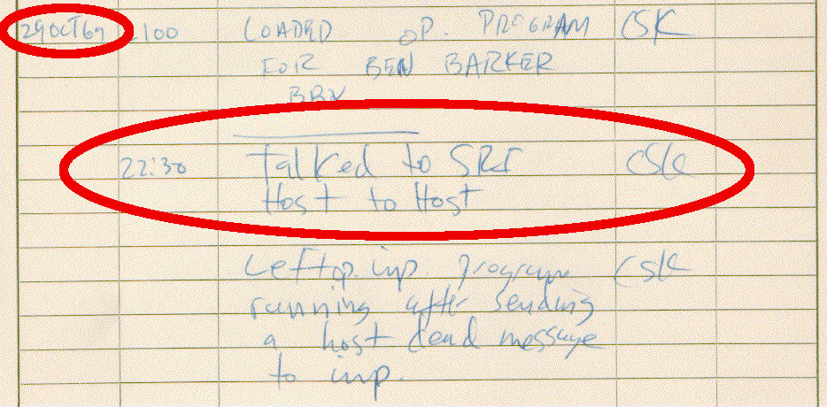
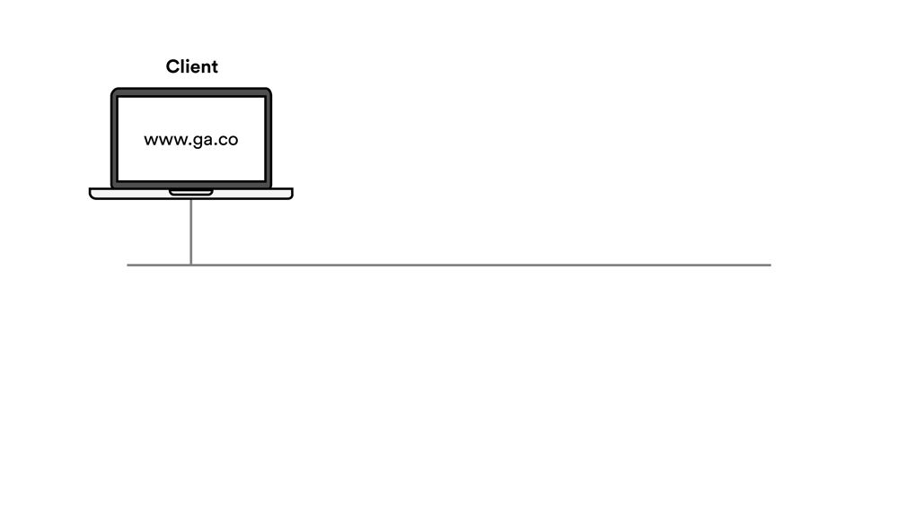
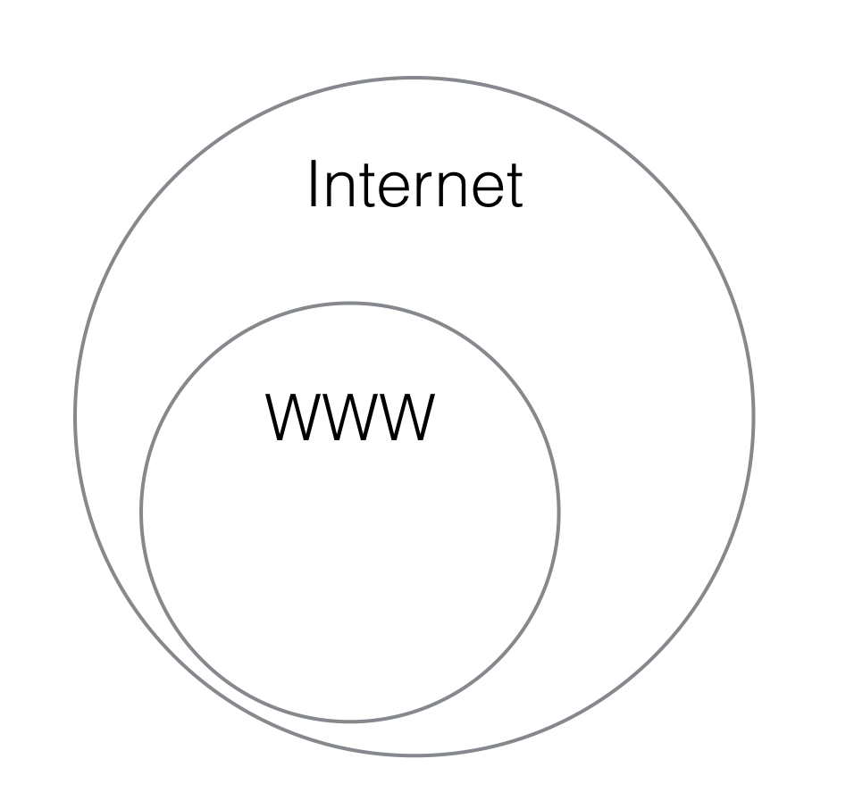

#  Internet Fundamentals


| Timing | Type | Topic |
| --- | --- | --- |
| 5 min | Opening | [Opening](#opening) |
| 15 min | Intro to New Material | [How Does the Internet Work](#how-does-the-internet-work) |
| 15 min | Intro to New Material | [The Internet Protocol Suite](#the-ip-suite)  |
| 20 min | Guided Practice | [Play the IP and TCP Game](#play-the-ip) |
| 15 min | Intro to New Material | [RESTful Approach](#restful-approach)  |
| 15 min | Intro to New Material | [The World Wide Web](#the-world-wide-web) |
| 5 min | Conclusion |[Q & A](#conclusion)|

<!--See above for correct structure for the lesson outline table.  "Type" should list what type of activity (Intro to New Material, Demo, Independent Practice, etc) and "Topic" should be the concept that is covered. -->

### LEARNING OBJECTIVES
*After this lesson, you will be able to:*

- Understand an Internet Protocol (IP) address
- Break down the components of a URL: protocol, subdomain, domain, extension, resources
- Differentiate between the internet and the world wide web
- Identify and describe the most common HTTP request/response headers and the information associated with each
- Illustrate how data travels through the internet through the response/request cycle
- Describe the basics of how computers communicate (IP, TCP, HTTP)

<!--Feel free to remove Student and Instructor pre-work sections if there is nothing applicable to be included.  -->
---

<a name="opening"></a>
## Opening (5 mins)

> Instructor Note: Review lesson objectives; describe real-world relevance or motivating example why this lesson is important


*This workshop is relevant to developers because:*

Just how a race-car driver should understand how their car runs, it is imperative for web developers to have clear mental models of how the Internet functions when building web applications. Knowledge of Internet fundamentals will allow for new concepts to be understood in a more complete context.

<a name="how-does-the-internet-work"></a>
## How does the Internet work? (15 mins)
<!-- Will this section really take 15 minutes? -->
#### What is the Internet?

* A network of interconnected computers that communicate over a given set of protocols.


#### How did the internet begin?
**The First Internet Communication**



"Lo" and behold, the first Internet communication was sent over a network of computers called the ARPANET from UCLA to Stanford.


#### How Do Computers Share information / Communicate?

1. Shared file systems
2. Shared databases
3. Remote Procedure Calls (RPC) - synch
4. Messages - asynch

#### How Do Computers do (3) or (4) ?

* Addresses
* Protocols


<a name="the-ip-suite"></a>
## Internet Protocol and Addresses (15 mins)

#### Addresses:

* What is an address?
* What is a street address?
* What is a phone number?
* What is a computer address?
  - IP = 74.125.21.113

```
dotted-decimal notation:    74     .     125    .     21     .    113
binary notation:         01001010     01111101     00010101     0111001
hexadecimal notation:       4A           7D           15           71
```

#### IPv4 and IPv6

* An IPv4 address = 4 bytes = 32 bits = 2^32 unique addresses = 4 billion addresses
* We now have more than 4 billion computing devices so we need more bits to address all of them.

#### Enter IPv6

* Has 16 bytes = 128 bits = 2^128 unique addresses
* That means we can assign 100 addresses to every atom on the surface of the earth.

#### Static vs. Dynamic IP Addresses

* servers need static IP addresses
* clients can have dynamic IP addresses

#### What is a URL?

* Uniform Resource Locator
* scheme://domain:port/path?query_string#fragment_id


#### Example:

[http://www.google.com:80/search?q=taylor+swift](http://www.google.com:80/search?q=taylor+swift)

<table>
  <tr>
    <th>PROTOCOL</th>
    <th>HOST (AKA DOMAIN)</th>
    <th>PORT</th>
    <th>PATH</th>
    <th>QUERY PARAMS</th>
  </tr>
  <tr>
    <td>http://</td>
    <td>www.google.com</td>
    <td>:80</td>
    <td>/search</td>
    <td>?q=taylor+swift</td>
  </tr>
</table>


#### LAN vs. WAN

* Local Area Networks
  - can have a private set of addresses:
  - 16-bit LAN addresses: 192.168.0.0
  - 24-bit LAN addresses: 10.0.0.0

```
$ ping google.com
$ ifconfig | grep inet

PING google.com (74.125.196.101): 56 data bytes
64 bytes from 74.125.196.101: icmp_seq=0 ttl=44 time=15.184 ms
```

Browser URL - http://74.125.196.101/


		http://www.kittengifs.com:80/popular-gifs#results?term=cute&page=2
		|-----|-----------------|---|-----------|--------|----------------|
		   |           |          |       |          |           |
		 protocol    host       port    path     fragment  query-string


#### Ports - like a telephone extension

Some Common Default Ports:

    FTP:    20
    SSH:    22
    TELNET: 23
    SMTP:   25   Simple Mail Transfer Protocol (email)
    DNS:    53
    HTTP:   80
    POP2:  109   Post Office Protocol (email)
    POP3:  110   Post Office Protocol (email)
    SQL:   118
    IMAP:  220   Internet Message Access Protocol (email)
    LDAP:  389   Lightweight Directory Access Protocol
    SHTTP: 443   Secure HTTP (HTTP over SSL)
    RSH:   514   Remote Shell
    IPP:   631   Internet Printing Protocol

#### Socket: the combination of an IP address and a Port

Hint: think of an IP address as something like a telephone number and the port as an extension

Examples:

```
127.0.0.1:3000      port 3000 on the internal loopback address
localhost:3000      port 3000 on the internal loopback address
74.125.196.101:80   port 80 (the HTTP port) at google.com
```

#### Asynchronous Request / Response

* Synchronous: phone conversation
  - establishes a dedicated connection (circuit switching)

* Asynchronous: email, text message
  - sends messages back and forth (packet switching)


<a name="play-the-ip"></a>
## The Internet Protocol Suite - Play the IP and TCP Game (Meet Ivan Pakkitz) (20 mins)

So how does data travel through the internet?

Any data you send over the Internet is split up into data packets. Each packet is routed to the destination eventually, but may all take different paths to get there.

Let's take a look at an example.

#### Ivan Pakkitz

Ivan is a postal worker who can travel at the speed of light. He's happy to relay thousands of messages per second between you and a friend. However, he can only transport one message at a time and each message has to fit on a single index card.

Unfortunately, Ivan is incredibly inattentive, so there are a few minor limitations in his service:

* Reliability: He cannot guarantee that every message will be delivered successfully.
* Order:       He cannot guarantee delivered messages will arrive in the same order that they were sent.
* Integrity:   He cannot guarantee that all messages will arrive in their entirety.
* Recipient:   He cannot guarantee that messages will always be delivered to the correct recipient.

For our lab, we will assume that Ivan:

<!--Can we be more specific in this section about what the Guided Practie is?  How do Ivan and Debbie fall into this exploration?  -->

* Shuffles the cards before delivering them
* Sometimes drops a card on the floor (maybe 1 out of 10 cards)
* May rip the card in half before delivering it (maybe 1 out of 20 cards)
* May deliver the card to the wrong person (maybe 1 out of 20)

#### Debbie N. Smith

* Meet our next character: Debbie N. Smith.
* She knows the numeric address of everyone

Let's look at an example:

I know your name but need to lookup your phone number

    becomes

I know your DNS name (google.com) but need to lookup your IP address.

Domain Name Service is in charge of mapping domains to IPs.

Example: `mail.google.com`

```
mail = subdomain
google = 2nd level domain
com = top level domain
```





#### Circuit vs. Packet Switching

* Circuit Switching
  - think making a phone call
  - what does it mean to get a "fast busy" signal?

* Packet Switching
  - think sending packages via FedEx

**_Question: If I send 5 packages to Gerry, will all 5 packages_**

```
(a) arrive in the order I sent them?
(b) arrive via the same truck?
(c) arrive via the same route?
(d) does it matter?
```

* Which is Faster?
* Which is More Fault Tolerant?

<!--Can these questions be more specific?  Should they say "Is circuit-switching or packet-switching faster?" and "Is circuit-switching or packet-switching more fault tolerant"?  -->

#### Messages and Packets
* Packet: a discrete chunk of data transferred over an IP-based protocol.
* Header: meta data to address and define the packet content.
* Body: the data payload of the packet.


<!--Please add graphic to the custom graphics spreadsheet-- we should replace this with a better-quality GA graphic.  -->


* Packets have a fixed maximum size (no 18 wheelers please)
  - theoretical maximum size of a TCP packet = 64KB
  - but usually the limit is smaller
  - the MTU (Maximum Transmission Unit) for Ethernet, for instance, is 1500 bytes
* Thus a single message is often split across several packets
* For example, the request for a 300KB image would require 300 * 1024 / 1500 = 205 packets.


#### TCP = Transmission Control Protocol

Builds upon the foundation of IP:

* Adds reliability (handshakes to confirm receipt, can resend on failure)
* Reorders out-of-order packets
* Checks message integrity
* Controls network congestion

See: [The Anternet](http://priceonomics.com/the-independent-discovery-of-tcpip-by-ants/)

TCP is great for plain text messages like web content, e-mails, and IMs.


<a name="restful-approach"></a>
## RESTful approach (Representational State Transfer) (15 mins)

#### What is REST?

Created by Roy Fielding for his Ph.D. thesis.

* TCP/IP gives us packetized messages with guaranteed delivery and integrity checks.
* HTTP gives us CREATE, PUT, POST, DELETE, and sometimes PATCH
* RESTful is an approach to using HTTP to do CRUD-like operations between a web client and a web app.

* Representational State Transfer:
  - client/server separation of responsibilities
    - client manages user state and user interface
    - server keeps persistent data
  - stateless: all of the needed state is transferred to the client so that the server can be stateless
  - the URL represents the unique identity of the resource
  - the client can send specific HTTP requests to the server with a payload of the state needed to fulfill the request

| Resource    |      GET     |    PUT     |    POST     |    DELETE  |
|:-----------:|:------------:|:----------:|:-----------:|:-----------:
| Collection  | get a list   | replace    | add an      | delete the |
|   /todos/   | of items*    | the entire | item to the | entire     |
|             |              | collection | collection* | collection |
|             |              |            |             |            |
| Element     | get an item* | replace an |     NA      | delete the |
|   /todos/3  |              | item*      |             | item*      |
|             |              | i.e. save  |             |            |

<!-- please double-check formatting of table.  Is this final? -->

* The cells above with an asterisk are the most common cases
* GET is immutable
* PUT and DELETE are important
* PATCH is the new kid on the block and allows for partial updates
  (i.e. the client can send only the parts of the item that need to be updated and the server merges these with the current item state)

#### More RESTful Examples:

* http://mytodos.com/mikeh/todos
* http://mytodos.com/mikeh/todos/3
* http://mytodos.com/mikeh/todos?due='2014-10-08'
* http://mytodos.com/mikeh

<a name="the-world-wide-web"></a>
## The World Wide Web (15 mins)

#### World Wide Web vs. The Internet

The Internet is the actual network that connects computers together and encompasses a wide range of protocols. The World Wide Web only represents a specific protocol on the Application layer of the Internet Protocol Suite.



#### HTTP - HyperText Transport Protocol

HTTP is a protocol on the application layer that the World Wide Web uses to communicate. It is responsible for delivering HyperText files and applications. More specifically, browsers rendering HTML files will use the WWW.


* Leverages TCP for sending text and file content with integrity.
* Defines a new format for addressing higher-level applications.
* HTTP Requests (verbs) - GET, PUT, POST, DELETE, PATCH


#### History of the World Wide Web

Tim devised a system for sharing HyperText documents while at CERN. During the late 80s and early 90s he specified the first versions of HTML and HTTP that ended up birthing the World Wide Web and changing the usability of the Internet forever.

<!-- add Tim's last name! -->

#### What is HyperText?


In the 1960s Douglas Engelbart demonstrated a machine that was capable of rich media, collaborative text editing, and teleconferencing. Now HTML, aka HyperText Markup Language, enables anyone to design rich media documents that are literally "beyond" (hyper) text.


#### The W3C

So who is in charge of the WWW?


The Technical Architecture Group meets regularly to discuss, document, and build Web standards. This group consists of 9 participants, some from outside organizations like Microsoft, Google, and Mozilla. They are known as the World Wide Web Consortium or W3C.


#### HTML, CSS & JS
So how does HTML relate to CSS and Javascript?


<!-- We can probably replace this image with a more high-quality graphic.  Please add to the graphics spreadsheet! -->

You can think of HTML CSS and JS as the three major parts of speech in human language: nouns, adjectives, and verbs.
- HTML is the noun as it is in charge of organizing content (text, photos, videos, audio, links, etc) into a file.
- CSS is the adjective as it is entirely concerned with the visualization of the content.
- JavaScript is the verb as it can add behavior and dynamism to the content.


<!--Can you please suggest a couple of checks-for-understanding throughout the lesson?  -->


 ***

<a name="conclusion"></a>
## Conclusion (5 mins)
- Recap topics covered in today's lesson
- Review objectives

There's tons of technical acronyms and jargon in the world. Understanding the basic building blocks of Internet & web technologies will help you communicate, grasp new concepts independently, and demystify concepts on your learning journey to become better web developers.


***

### ADDITIONAL RESOURCES
- Videos
	- [GA’s Video on How the Internet works](https://generalassembly.wistia.com/medias/zg9altep4r)
	- [A Packet's Tale](https://www.youtube.com/watch?v=Gfoc3Cxgnpk)


- Readings
	- [The Anternet](http://priceonomics.com/the-independent-discovery-of-tcpip-by-ants/)
	- [HTTP Intro](https://dev.opera.com/articles/http-basic-introduction/)
	- [TCP/IP Protocol Explained](http://www.thegeekstuff.com/2011/11/tcp-ip-fundamentals/)
	- [Internet Protocol Suite Wikipedia Page](https://en.wikipedia.org/wiki/Internet_protocol_suite)
	- [How the Internet Works — Stanford](http://web.stanford.edu/class/msande91si/www-spr04/readings/week1/InternetWhitepaper.htm)
