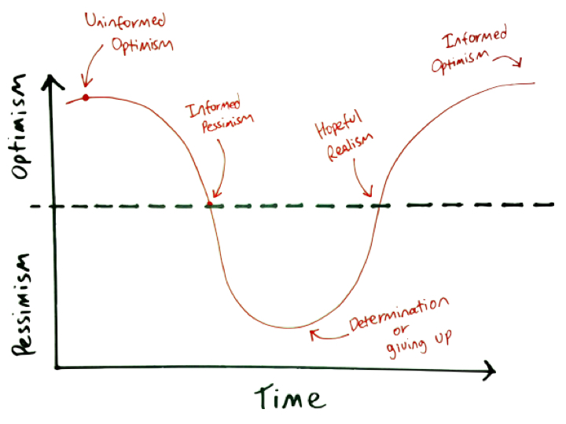

#   Welcome to WDI: Learning experience + classroom culture (60 mins)

| Timing | Type | Topic |
| --- | --- | --- |
| 10 min | [Your Instructional Team](#introduction) | Topic |
| 10 min | [What to Expect](#expectations) | Topic |
| 10 min | [GA Culture](#ga-culture) | Topic |
| 15 min | [Student Expectations](#student-expectations) | Topic |
| 5 min | [Plagiarism](#plagiarism) |Topic |
| 10 min | [Student Work](#student-work) |Topic |
| 25 min | [Icebreakers](#icebreakers) |Topic |
| 5 min | [Icebreakers](#icebreakers) |Topic |

### LEARNING OBJECTIVES
*After this lesson, you will be able to:*

- Set expectations for the course
- Align class on goals for the course
- Get to know each other
- Establish Class culture

### INSTRUCTOR PREP
*Before this lesson, instructors will need to:*

- Fill in relevant details for your specific course
- Optional: Create deck for intro session. For an example, see: [Orientation Deck](https://drive.google.com/file/d/0B-kyGN2IJQspMGlxTUVmcGY1OVE/view)

---

## Your Instructional Team (10 mins)

#### Instructor Introduction
- Instructor Names

  > Instructor Note: Fill in with relevant details about your course

#### Roles
1. Instructor Lead
  - Lesson Blocks
  - Code-alongs
  - Labs
  - Each instructor takes a different topic for each unit
  - Grading homework
1. Instructor Associate
  - Morning Exercises
  - Afternoon Code Reviews
  - Wednesday 2nd Pass / Reviews
  - Creating Homework
  - Grading homework
1. Evening TA
  - one-on-one help

  > Instructor Note: Fill in with relevant details about your course

## What to Expect (10 mins)

#### Emotional Framing
- Programming is not about learning a sequence of steps, it's about developing a mindset to solve problems and think programmatically.
- Progamming language not as important as
    - critical/analytical/programatic thinking.
    - don't memorize, conceptualize ideas.
        - the internet is your notebook/memory
    - be able to adapt quickly
- Deal with chaos in your head. Being confused/lost is NORMAL. No one pays you because you know all the answers. The job is about jumping into confusion and being able to find a solution.
- Development can be very personal
	- Debugging your own mistakes
	- Being a good "Googler" and reading tech documents takes practice
	- You learn more by doing than by listening
	- We try not to hold your hand
		- There is a decent amount of failure that happens initially
			- good to get that out of the way before starting work
- Hard Work: 80-90hrs/wk minimum
- The maximum point of learning is right at the edge of learning and panic.

- This experience is a rollercoaster.

## GA Culture (10 mins)

#### Classroom Culture
- Open safe environment
- Keep criticism positive and constructive
- Take ownership of your experience
- Check your ego at the door
- Empathy
- Don't compare yourself to others, compare yourself to who you were yesterday
- You get what you put in

#### Mentorship Culture
- Collaborative and supportive - offering help
- Benchmarking; some are good at one thing, others at another. Leverage each other's strengths.
- Teaching is the best way of truly solidifying your understanding of a concept.
- Your classmates will be the best foundation for establishing a professional network in tech!

## Student Expectations (15 mins)
1. Be Present
  - Attendance at 10:15am
  - Pay attention
  - Let us know if you are running late - Slack instructor
  - Excused Absences
  - Multiple lateness = absence
  - Contractual limit of absences in order to complete the program
1. Be Persistent
1. Be Independent
1. Be Thoughtful
1. Be Creative
	- this is not paint by numbers
1. Be present and mindful - not distracted

 > Instructor Note: Fill in with relevant details about your course

## Plagiarism (10 mins)
#### Statement

General Assembly takes academic honesty very seriously, and as such will not tolerate any student who plagiarizes in order to satisfy class requirements.  Programs at General Assembly are intensive, require a lot of work on the part of the student, and students will occasionally not be able to complete work in a timely fashion.  

Rather than rely on work that’s not your own to create the appearance of success, let your instructional team know as early as possible that you are not prepared for the work.  It is much easier to come up with a plan, than it is to succeed if you’ve been removed from the program.

#### Definition

Plagiarism is the act of claiming that work that does not belong to you is in fact your own.  It can take many forms, and each concentration at General Assembly will have a slightly different guideline to identify plagiarism in their field.  

Generally it is safe to assume that if you are including work that does not belong to you in an effort to build on your own work — cite it.  If you are using work that does not belong to you as a replacement for your own work, you’re probably plagiarizing.

#### Procedure

If an instructor is in doubt of a students work or has evidence of plagiarism, the student will be asked to justify the work they've submitted.  Should they be unable to show the work they have claimed as their own is in fact theirs, the student will face disciplinary action.  

On a first offense a student will be placed on probation and asked to produce new material conforming to the original assignment.  If a student is already on probation then they will be removed from the program they are in, and prevented from taking further classes at General Assembly.

In egregious offenses (presenting another student’s project, an external product, work you did before being a student at General Assembly, work contracted out to professional developers, etc.), disciplinary action should be escalated to removal from the program.

## Intro to Assessments and Exit Tickets (10 mins)

#### Stand-Up
- Wins
- Repass
- Feeling

#### Team Building
- Try to pair with someone new everyday.

#### Common Student Worries
1. I'm making a lot of mistakes
1. Imposter syndrome
1. I don't "do" math
1. What's the best practice? Finding the one "correct" answer
	- Best practices change constantly and from company to company
	- If you think properly, you'll probably naturally arrive at a best practice
	- All that matters is "Does it work?"
		- A company that hires someone with 3 months of experience doesn't really care about code quality
		- Use your time to learn new technology or strengthen your problem solving
1. Having a perfect understanding of everything
	- Class is set up to accommodate students of all abilities
		- Scaffolded lecture notes, homework, and projects
	- We make sure you understand at least the most important concepts
1. Having an amazing portfolio/completing all assignments
	- all projects suck
		- what matters is the ability to think
	- don't worry about completing every lab/homework
		- they're there as an exercise in thinking
		- completing and sleeping for 2 hours is worse than sleeping and not completing
1. Asking questions
	- ask only when you've been stuck for several hours
		- the more time you spend fixing, the more you learn
		- receiving an answer stops the learning process

#### Advice
1. Constant feedback
1. Stand up and walk around
1. Get out of home for a little bit each day 

<!-- Hi Sarah, what do you mean by "get out of home"? -->

## Icebreakers (25 mins)

#### Briefly Tell Us About You
- What's your name?
- Where are you from?
- What's your home town like?

#### Help us get to know you
- Tell us a guilty pleasure
- Share a fun fact about yourself

#### Your programming experience
- What did you enjoy about the programming you did in Fundamentals?

- Note to instructor: there are lots of fun ice breakers you can experiment with either today or over the course of the next several days to build the community and culture in the course.
***

## Conclusion (5 mins)
- Recap topic(s) covered in today's lesson
- Review objectives for lesson
