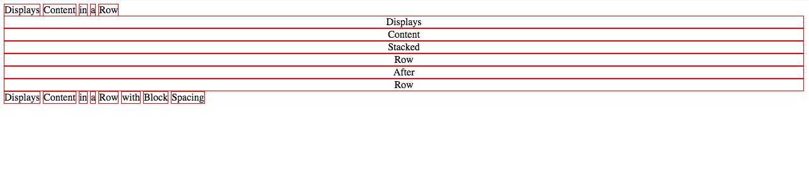

#  Box Model and Flexbox

| Timing | Type | Topic |
| --- | --- | --- |
| 10 mins | [Introduction](#introduction-box-model) | Box Model |
| 20 mins | [Demo/Codealong](#demo-box-model) | Box Model Demo |
| 5 mins | [Refresher](#display) | Display |
| 5 mins | [Refresher](#floats) | Floats |
| 20 mins | [Demo/Codealong](#demo-flexbox) | Flexbox Demo |
| 30 mins | [Independent Practice](#ind-practice) | Hyrule Potion Shop |

### LEARNING OBJECTIVES
*After this lesson, you will be able to:*
- Use the Box Model to style element borders and structure your page
- Understand the value of box-sizing: border-box; and apply it to the page layout as needed
- Adjust element spacing using padding and margin
- Describe the difference between block, inline, and inline-block elements
- Explain the difference between and use cases of static, relative, fixed, & absolute positioning

***

<a name="introduction-box-model"></a>
## Introduction: Box Model (5 mins)

All HTML elements can be considered boxes. Even if you see a circle, it's living within a box.

The CSS box model describes this principle - a box wraps around all HTML elements, and it consists of: margins, borders, padding, and the actual content. This model allows us to place a border around elements and space elements in relation to other elements. With CSS properties and values, it is possible to apply specific styles to each of these elements, and change the way they behave and/or display on the page.

#### Layout: Turn & Talk (5 mins)
- Install the <a href="https://chrome.google.com/webstore/detail/pesticide-for-chrome/bblbgcheenepgnnajgfpiicnbbdmmooh">Pesiticide Chrome Extension</a>, which visualizes all DOM elements as boxes.
- Work with a parter to investigate a few different sites using the extension, and discuss how the Box Model might help you to control layout.

***

<a name="demo-box-model"></a>
## Demo / Codealong: Box Model Demo (# mins)
Let's write some code to help us visualize the Box Model. Paste the following into Codepen.

```html
<header>
  <h1>Box Model Pro</h1>
  <nav>
    <a href="#">About</a>
    <a href="#">Demo</a>
    <a href="#">Contact</a>
  </nav>
</header>

<div>
  <p>Lorem ipsum dolor sit amet, consectetur adipisicing elit. Iusto commodi aspernatur quae possimus! Veritatis ad libero maiores. Assumenda quae <a href="#">perspiciatis</a> dolore voluptatem porro optio eos, nemo et eligendi, voluptatum necessitatibus.</p>
</div>
```

```css
body {
  font-family:Georgia, serif;
}

header {
  text-align:center;
}

nav a {
  margin:1em;
  text-transform:uppercase;
}

h1 {
  font-size:3em;
}

p {
  font-size:1em;
  line-height:1.618em;
}

a {
  font-weight:bold;
  color:inherit;
  text-decoration:none;
}
```

Dynamite! Now, navigate to your dev tools and under the elements tab, hover over each of the elements. What do you notice? A "box" is being highlighted in your browser!

What happens when we drop this code into the CSS file?

```css
* {
    border: 1px solid red !important;
}
```

The universal selector ```*{ }``` is a great way to apply a style to every element on the page *without* using inheritance. We'll teach you more about this selector in a later lesson. For now, it helps us see the boundaries of different elements. Pay special attention to how much space elements take up on the page, and how that space differs for block and inline elements.

### Box Model Components
The image below illustrates the box model and what you should have seen in your dev tools:


But what do these different layers mean, and how are they related to one another?
- Margin: clears an area around the border (or boundaries of the padding if no border); the margin does not have a background color, it is completely transparent
- Border: a border that goes around the padding and content; the border is affected by the background color of the box unless a color is declared
- Padding: clears an area around the content; the space between the content and the border; the padding is affected by the background color of the box
- Content: the content of the box, where text and images appear

Let's get go into some more detail and practice with each of these elements of The Box Model.

#### Margin
The margin is the space around the element. The larger the margin, the more space between our element and the elements around it. We can adjust the margin to move our HTML elements closer to or farther from each other.

Adjusting our margins not only moves our element relative to other elements on the page but also relative to the "walls" of the HTML document. For example, if we declare the width of our ```<div>``` and set its margin to auto, this tells the document to automatically put equal left and right margins on our element. The equal left and right margins calculate based on the width of the document, centering it on the page.

```css
div {
  width:40em;
  margin:4em auto;
}
```

If you want to specify a particular margin, to a particular side, you can do it like this:
```css
div {
  margin-top: /*some value*/
  margin-right: /*some value*/
  margin-bottom: /*some value*/
  margin-left: /*some-value*/
  }
```

You can also set an element's margins all at once using shorthand, which reads clockwise around the content (top, right, bottom, left):

```css
div {
  margin: 1px 2px 3px 4px;
}
```

You'll typically use 1-2 values with the margin property, where 1 value controls all 4 margins and 2 values control the top & bottom, left & right margins respectively. For more on shorthand, read <a href="https://developer.mozilla.org/en-US/docs/Web/CSS/Shorthand_properties">MDN</a>.

```css
div {
  margin: 40em auto; /*top & bottom margins are 40em; left & right margins are auto*/
}

p {
  margin: 2em; /*all margins 20px*/
}
```

#### Border
The border is the edge of the element. It's what we've been making visible every time we set the border property. You can use shortand for setting ```border```, just like we did with ```margin```. Lets add a border to our ```<div>```:

```css
div {
  width:40em;
  margin:4em auto;
  border: 1px solid #000;
  /*
  border-width:1px;
  border-style:solid;
  border-color:#000;
  */
}
```

#### Padding
The padding is the spacing between the content and the border. Padding comes in handy for creating space between the text and the border, or using the background color of the box. We can adjust padding to move the border (or boundaries of our box) closer to or farther from the content. Shorthand can be used with padding as well. Let's try out some changes to our ```div``` with the border.

```css
div {
  width:40em;
  margin:4em auto;
  border: 1px solid #000;
  padding:2em;
}
```

Much better! The text is more readable and the page itself has more visual balance. What if our ```div``` has a background color and no border?

```css
div {
  width:40em;
  margin:4em auto;
  /* border: 1px solid #000; */
  padding:2em;
  background:#eee;
}
```

Our container still looks great!

**Important Note**:

Padding and Border will increase the width of your element, even if you've *declared* the width. In the CSS above, we see the width set to `40em`, and the padding set to `2em`. What is the actual width of this element? What would the width be if we kept the border declaration?

- `44em`
- `44em` + '2px' (We can't calculate without knowing the base size of `em`.)

This width increase can cause frustration and confusion when we start to create column-based layouts. You may want to consider using `box-sizing:border-box;`, which ensures that the width you declare is the final width of the entire element, including content, padding and border. Declaring width using the initial `box-sizing` value of `content-box` (this will be applied if you don't call `box-sizing`) means that width determines the width of the content *only*. Read more about the `border-box` method [here](https://www.paulirish.com/2012/box-sizing-border-box-ftw/).


<a name="display"></a>
## Refresher: How Display Affects Spacing & Layout (5 mins)
We just learned each HTML element gets its own box to live in. Cool, right?

As you saw, the outermost box of each element went all the way across the page. This is why, until now, your HTML elements have been sitting on top of one another: by default, they take up the full width of the page. We can change all this with the first positioning property we'll learn, the display property and the four values we can use:
- inline
- block
- inline-block
- none.

An **inline element** has no line break before or after it. This makes the element sit on the same line as another element, but without formatting it like a block. It only takes up as much width as it needs (not the whole line). Inline places all your elements on a single line. The bad news is that it doesn't maintain their "box"ness, so exciting techniques like centering with `margin:auto;` are not possible with inline elements.

A **block element** has some whitespace above and below it and does not tolerate any HTML elements next to it without further styling. This makes the element a block box. It won't let anything sit next to it on the page and takes up the full width.

An **inline-block element** is _placed_ as an inline element (on the same line as adjacent content), but it _behaves_ as a block element. This makes the element a block box but will allow other elements to sit next to it on the same line.

If you assign ```none``` as the value of the ```display```, this will make the element and its content disappear from the page entirely! However, some browsers
<!--Please complete or delete the incomplete sentence above.  -->

To illustrate all ```display``` values, consider this HTML:
```html
    <div class="inline">Displays</div>
    <div class="inline">Content</div>
    <div class="inline">in</div>
    <div class="inline">a</div>
    <div class="inline">Row</div>

    <div class="block">Displays</div>
    <div class="block">Content</div>
    <div class="block">Stacked</div>
    <div class="block">Row</div>
    <div class="block">After</div>
    <div class="block">Row</div>

    <div class="inline-block">Displays</div>
    <div class="inline-block">Content</div>
    <div class="inline-block">in</div>
    <div class="inline-block">a</div>
    <div class="inline-block">Row</div>
    <div class="inline-block">with</div>
    <div class="inline-block">Block</div>
    <div class="inline-block">Spacing</div>

    <div class="none">Displays nothing!</div>
```

With this CSS:

```css
div {
  border:1px solid red;
  text-align:center;
}

.inline {
    display: inline;
}

.block {
    display: block;
}

.inline-block {
    display: inline-block;
}

.none {
    display:none
}
```

We would end up with something like this:



***

<a name="floats"></a>
## Refresher: Floats (5 mins)
You've likely used floats in the past to build column layouts, but Flexbox is now considered best practice for grid layouts. However, sometimes our layout goals are simpler; rather than pinpointing the position of an element, we may just want to move it to the left or right side of a page. We accomplish that using `float`.

A basic example you'll encounter in most tutorials is the "text wrap", or surrounding an image with text:


<!-- SME NEEDED: example code for image above -->

* Images are, by default, `inline` elements.
* To remove them from that flow and re-position them, we set `float` to either `left` or `right`.
* We can also do this with multiple images with similar or varying `float` values.

### Clear
Floating, without the use of `clear`, can cause some serious layout issues. Let's see what happens if we remove the text from the previous example.

<!-- SME NEEDED: example code for description above -->

* What happens to the container when we set our image to `float: left;`?
* What about if we substitute our image with a block element (e.g., `<div>`)?
* When all the elements inside a container are floated, it shrinks to the smallest size possible.
  * Inline element dimensions are ignored.
  * Block elements are condensed to the smallest size possible.

We can fix these issues by adding an empty `<div>` with a property of `clear: both;`. This allows the container to resize to fit its children elements. This empty `<div>` is bad practice, though. There's a better way!

### Enter: The Clearfix
[Nicolas Gallagher](http://nicolasgallagher.com/micro-clearfix-hack/) created a technique that eliminates the bad practice issues `clear: both;` causes, simply by adding a class to the parent container. And because it's a class, it's reusable!

<!-- Is this complete?  This doesn't seem like a complete explanation of the Cleafix. -->

***


<a name="demo-flexbox"></a>
## Demo / Codealong: Flexbox Demo (20 mins)
From [MDN](https://developer.mozilla.org/en-US/docs/Web/CSS/CSS_Flexible_Box_Layout/Using_CSS_flexible_boxes): "The CSS3 Flexible Box, or flexbox, is a layout mode providing for the arrangement of elements on a page such that the elements behave predictably when the page layout must accommodate different screen sizes and different display devices."

We'll be using Flexbox to build our column-based, grid layouts. In addition to creating incredible structure on our page, Flexbox solves a lot of layout issues that `float` either causes or cannot solve (or both!).

### Problem 1: Vertical alignment
I have a div. I would like to center it vertically and horizontally on my page. Seems simple enough, right?

#### You tell me: What should I try?

Here's some starter code:

```html
<body>
  <div>This is my div!</div>
</body>
```

```css
html {
  height: 100%;
}
body {
  min-height: 100%;
  background-color: #ccc;
  margin: 0 auto;
}
div{
  width: 100px;
  height: 100px;
  outline: 1px solid red;
}
```

This problem has been the laughingstock of CSS for years: how can something so obvious be so difficult to accomplish?

### Flexbox to the Rescue

```css
html {
  height: 100%;
}

body {
  min-height: 100%;
  background-color: #ccc;
  margin: 0 auto;
  display: flex;
  flex-direction: row;
  justify-content: center;
  align-items: center;
}

div {
  width: 100px;
  height: 100px;
  outline: 1px solid red;
}
```

#### How it works

When you declare `display:flex` on a container, it becomes a **flex container**.

First, you use `flex-direction` to indicate whether you want the items in the container -- the **flex items** -- to "read" left-to-right (`row`), right-to-left (`row-reverse`), top-to-bottom (`column`), **or** bottom-to-top (`column-reverse`).

When you specify a flex-direction, you can think of it as placing an axis in that direction across your flex container. So if you use `flex-direction:row` or `row-reverse`, this **main axis** will be the same as the X-axis (horizontal) on a graph. Otherwise, it'll be the Y-axis.

Then, you determine how you want to align or **justify** the items along this main axis using the `justify-content` property. It'll do nice things for you like let you put even spacing between all the items (`spacing-between` and `spacing-around`).

Finally, you control how you align the items along the axis that goes across the main axis -- the **cross axis**, if you will -- with the `align-items` property. If you have `flex-direction:row`, the main axis is the X-axis, and the cross-axis is the Y-axis.

Lastly, you can also do nice things like control how you want things to line up across the cross-axis by using `align-content`, such as `space-between` and `space-around`.

### Problem 2: Make the footer stick

I want my footer to lie along the bottom of my page.

#### You tell me: What should I try?

Starter code:

```html
<body>
  <header>This is my header.</header>
  <main><p>Blah blah blah blah blah...</p></main>
  <footer>This is my footer!</footer>
</body>
```

```css
html {
  height: 100%;
}

body {
  min-height: 100%;
  background-color: #ccc;
  margin: 0 auto;
}

footer {
  width: 100%;
  height: 50px;
  background-color: #888;
}
```

Making the footer lie against the bottom of my *screen* is pretty easy: I can just use absolute or fixed positioning. However, using absolute or fixed positioning means everything else on the page ignores my footer. The text of my `main` could easily run under my footer. I want the text of my `main` to "push" my footer to the end of the page.

### Flexbox to the rescue

```css
html {
  height: 100%;
}

body {
  min-height: 100%;
  background-color: #ccc;
  margin: 0 auto;
  display: flex;
  flex-direction: column;
}

footer {
  width: 100%;
  height: 50px;
  background-color: #888;
}
```

#### What's the main axis on here? The cross axis?


Four more terms: the **main start** (`flex-start`), where the start of the main axis is, the **main end** (`flex-end`), and the cross starts and ends.

#### Recap

- `justify-content`: Align along flex-direction (main axis)
- `align-items`: Align along not-flex-direction (cross axis)
- `align-content`: Space things along main axis
- `flex-basis`: How big the flex items "want" to be
- `flex-shrink`: If the flex container is too small to accommodate all the flex bases, the proportion a particular flex item will occupy
- `flex-grow`: If the flex container is too big for all the flex bases, the proportion a particular flex item will occupy
- `order`: The order in which you want flex items to appear along the main access. The default is 0. Negative numbers are allowed.

In particular, let's look at...

### The Holy Grail Layout


This is something you know well, even if you don't recognize the term. It describes a webpage with a header bar, a footer bar, and three columns along the middle: a wide "main" column, a navigation column on the left, and an advertisement, site map, or extra info column along the right.

Obviously, this layout won't work on tiny screens, unless you really like super-skinny columns. It's common to stack things on top of each other for mobile views to make one single column.

Before flexbox, this involved a lot of pushing and shoving with dimensions and positioning. You would essentially have to write two completely separate stylesheets: one for mobile, and one for desktop.

With flex box, just change the `flex-direction` for smaller screen sizes, and you're pretty much done!

```css
body {
  display: flex;
  flex-direction: row;
}

/* We'll talk more about media queries soon. For now, just understand that this rule for `body` applies to screens `480px` wide and below.*/

@media screen and (max-width: 480px) {
  body {
    flex-direction: column;
  }
}
```

***

<a name="ind-practice"></a>
## Independent Practice: Hyrule Potion Shop (30 mins)


<!-- SME NEEDED: updated version of code below -->
https://github.com/ga-dc/hyrule_potion_shop

***

## Hungry for more?
### Exercises
- [Build a Mondrian](https://googlecreativelab.github.io/coder-projects/projects/mondrian/)
- [Flexbox Froggy](http://flexboxfroggy.com)
- [Flexbox Defense](http://www.flexboxdefense.com)
- [Flexplorer](http://bennettfeely.com/flexplorer/)

### Videos
- [CSS Box Model](https://www.youtube.com/watch?v=HNgdhp1_kEE&list=PLdnONIhPScST0Vy4LrIZiYKpFNoxgyH7J&index=6)
- [CSS Display](https://www.youtube.com/watch?v=qjSe_K3agYc&list=PLdnONIhPScST0Vy4LrIZiYKpFNoxgyH7J&index=7)
- [CSS Floats](https://www.youtube.com/watch?v=-4Yy3WNmvmg&list=PLdnONIhPScST0Vy4LrIZiYKpFNoxgyH7J&index=11)
- [CSS Flexbox Intro](https://www.youtube.com/watch?v=tqdqEiTlqF0&list=PLdnONIhPScST0Vy4LrIZiYKpFNoxgyH7J&index=33)
- [CSS Flexbox: Wrap, Justify, Align](https://www.youtube.com/watch?v=7d8aAw8mzjI&index=34&list=PLdnONIhPScST0Vy4LrIZiYKpFNoxgyH7J)
- [CSS Flexbox: Child Properties](https://www.youtube.com/watch?v=zDYAbI78dzc&list=PLdnONIhPScST0Vy4LrIZiYKpFNoxgyH7J&index=35)
- [Flexbox Problem Solving Part 1](https://www.youtube.com/watch?v=wBlBTO7mqoI&index=109&list=PLae1he6d1WImFXtLgPt7MDAx6k6iP59EW)
- [Flexbox Problem Solving Part 2](https://www.youtube.com/watch?v=_I58MXDnBEs&index=110&list=PLae1he6d1WImFXtLgPt7MDAx6k6iP59EW)

### Readings
- [* { Box-sizing: Border-box } FTW](https://www.paulirish.com/2012/box-sizing-border-box-ftw/)
- [MDN Flexbox](https://developer.mozilla.org/en-US/docs/Web/CSS/CSS_Flexible_Box_Layout/Using_CSS_flexible_boxes)
- [A Visual Guide to CSS3 Flexbox Properties](https://scotch.io/tutorials/a-visual-guide-to-css3-flexbox-properties)
- [Solved By Flexbox](http://philipwalton.github.io/solved-by-flexbox/)
