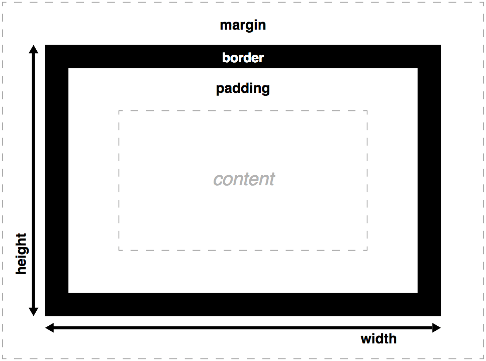

#  Box Model (30 mins)

| Timing | Type | Topic |
| --- | --- | --- |
| 10 mins | [Introduction](#introduction-box-model) | Box Model |
| 20 mins | [Demo/Codealong](#demo-box-model) | Box Model Demo |

### LEARNING OBJECTIVES
*After this lesson, you will be able to:*
- Use the Box Model to style element borders and structure your page
- Understand the value of box-sizing: border-box; and apply it to the page layout as needed
- Adjust element spacing using padding and margin

***

<a name="introduction-box-model"></a>
## Introduction: Box Model (5 mins)

All HTML elements can be considered boxes. Even if you see a circle, it's living within a box.

The CSS box model describes this principle - a box wraps around all HTML elements, and it consists of: margins, borders, padding, and the actual content. This model allows us to place a border around elements and space elements in relation to other elements. With CSS properties and values, it is possible to apply specific styles to each of these elements, and change the way they behave and/or display on the page.

#### Layout: Turn & Talk (5 mins)
- Install the <a href="https://chrome.google.com/webstore/detail/pesticide-for-chrome/bblbgcheenepgnnajgfpiicnbbdmmooh">Pesiticide Chrome Extension</a>, which visualizes all DOM elements as boxes.
- Work with a parter to investigate a few different sites using the extension, and discuss how the Box Model might help you to control layout.

***

<a name="demo-box-model"></a>
## Demo / Codealong: Box Model Demo (# mins)
Let's write some code to help us visualize the Box Model. Paste the following into Codepen.

```html
<header>
  <h1>Box Model Pro</h1>
  <nav>
    <a href="#">About</a>
    <a href="#">Demo</a>
    <a href="#">Contact</a>
  </nav>
</header>

<div>
  <p>Lorem ipsum dolor sit amet, consectetur adipisicing elit. Iusto commodi aspernatur quae possimus! Veritatis ad libero maiores. Assumenda quae <a href="#">perspiciatis</a> dolore voluptatem porro optio eos, nemo et eligendi, voluptatum necessitatibus.</p>
</div>
```

```css
body {
  font-family:Georgia, serif;
}

header {
  text-align:center;
}

nav a {
  margin:1em;
  text-transform:uppercase;
}

h1 {
  font-size:3em;
}

p {
  font-size:1em;
  line-height:1.618em;
}

a {
  font-weight:bold;
  color:inherit;
  text-decoration:none;
}
```

Dynamite! Now, navigate to your dev tools and under the elements tab, hover over each of the elements. What do you notice? A "box" is being highlighted in your browser!

What happens when we drop this code into the CSS file?

```css
* {
    border: 1px solid red !important;
}
```

The universal selector ```*{ }``` is a great way to apply a style to every element on the page *without* using inheritance. We'll teach you more about this selector in a later lesson. For now, it helps us see the boundaries of different elements. Pay special attention to how much space elements take up on the page, and how that space differs for block and inline elements.

### Box Model Components
The image below illustrates the box model and what you should have seen in your dev tools:



But what do these different layers mean, and how are they related to one another?
- Margin: clears an area around the border (or boundaries of the padding if no border); the margin does not have a background color, it is completely transparent
- Border: a border that goes around the padding and content; the border is affected by the background color of the box unless a color is declared
- Padding: clears an area around the content; the space between the content and the border; the padding is affected by the background color of the box
- Content: the content of the box, where text and images appear

Let's get go into some more detail and practice with each of these elements of The Box Model.

#### Margin
The margin is the space around the element. The larger the margin, the more space between our element and the elements around it. We can adjust the margin to move our HTML elements closer to or farther from each other.

Adjusting our margins not only moves our element relative to other elements on the page but also relative to the "walls" of the HTML document. For example, if we declare the width of our ```<div>``` and set its margin to auto, this tells the document to automatically put equal left and right margins on our element. The equal left and right margins calculate based on the width of the document, centering it on the page.

```css
div {
  width:40em;
  margin:4em auto;
}
```

If you want to specify a particular margin, to a particular side, you can do it like this:
```css
div {
  margin-top: /*some value*/
  margin-right: /*some value*/
  margin-bottom: /*some value*/
  margin-left: /*some-value*/
  }
```

You can also set an element's margins all at once using shorthand, which reads clockwise around the content (top, right, bottom, left):

```css
div {
  margin: 1px 2px 3px 4px;
}
```

You'll typically use 1-2 values with the margin property, where 1 value controls all 4 margins and 2 values control the top & bottom, left & right margins respectively. For more on shorthand, read <a href="https://developer.mozilla.org/en-US/docs/Web/CSS/Shorthand_properties">MDN</a>.

```css
div {
  margin: 40em auto; /*top & bottom margins are 40em; left & right margins are auto*/
}

p {
  margin: 2em; /*all margins 20px*/
}
```

#### Border
The border is the edge of the element. It's what we've been making visible every time we set the border property. You can use shortand for setting ```border```, just like we did with ```margin```. Lets add a border to our ```<div>```:

```css
div {
  width:40em;
  margin:4em auto;
  border: 1px solid #000;
  /*
  border-width:1px;
  border-style:solid;
  border-color:#000;
  */
}
```

#### Padding
The padding is the spacing between the content and the border. Padding comes in handy for creating space between the text and the border, or using the background color of the box. We can adjust padding to move the border (or boundaries of our box) closer to or farther from the content. Shorthand can be used with padding as well. Let's try out some changes to our ```div``` with the border.

```css
div {
  width:40em;
  margin:4em auto;
  border: 1px solid #000;
  padding:2em;
}
```

Much better! The text is more readable and the page itself has more visual balance. What if our ```div``` has a background color and no border?

```css
div {
  width:40em;
  margin:4em auto;
  /* border: 1px solid #000; */
  padding:2em;
  background:#eee;
}
```

Our container still looks great!

**Important Note**:

Padding and Border will increase the width of your element, even if you've *declared* the width. In the CSS above, we see the width set to `40em`, and the padding set to `2em`. What is the actual width of this element? What would the width be if we kept the border declaration?

- `44em`
- `44em` + '2px' (We can't calculate without knowing the base size of `em`.)

This width increase can cause frustration and confusion when we start to create column-based layouts. You may want to consider using `box-sizing:border-box;`, which ensures that the width you declare is the final width of the entire element, including content, padding and border. Declaring width using the initial `box-sizing` value of `content-box` (this will be applied if you don't call `box-sizing`) means that width determines the width of the content *only*. Read more about the `border-box` method [here](https://www.paulirish.com/2012/box-sizing-border-box-ftw/).

***

## Hungry for more?
### Videos
- [CSS Box Model](https://www.youtube.com/watch?v=HNgdhp1_kEE&list=PLdnONIhPScST0Vy4LrIZiYKpFNoxgyH7J&index=6)

### Readings
- [* { Box-sizing: Border-box } FTW](https://www.paulirish.com/2012/box-sizing-border-box-ftw/)
