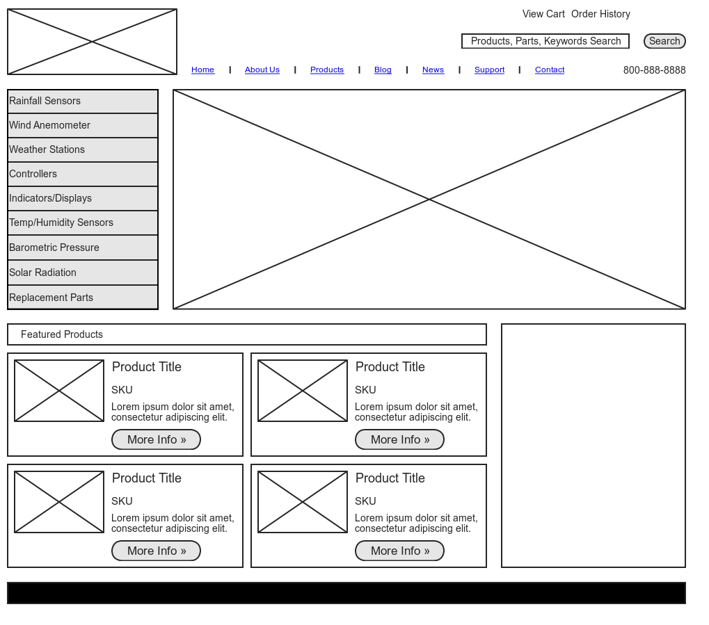
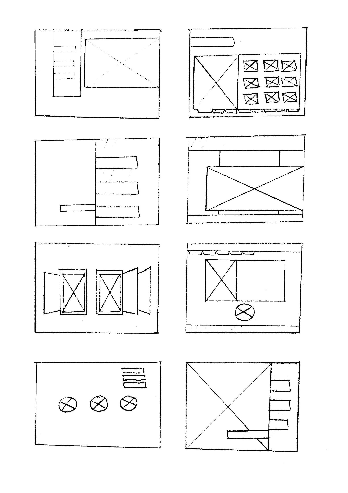

#  Wireframes, Layouts and Grid Systems (90 mins)

| Timing | Type | Topic |
| --- | --- | --- |
| 10 mins | [Introduction](#introduction-wf) | Wireframes |
| 10 mins | [Introduction](#introduction-grids) | Grid Systems |
| 30 mins | [Demo/Codealong](#demo) | Building a Grid |
| 40 mins | [Guided Practice](#guided-practice) | Match That Grid |

### LEARNING OBJECTIVES
*After this lesson, you will be able to:*
- Describe what a wireframe is and its role in a the development process.
- Describe the differences between low/medium/high fidelity markups.
- Create a wireframe to define the layout and user flow for your app.
- Describe the grid system

---

<a name="introduction-wf"></a>
## Introduction: Topic (10 mins)

Wireframes illustrate how the user navigates to and interfaces with information presented to them. A wireframe answers questions as general as "How does a user access the About page?" and as specific as "What will change on the screen if the user clicks 'submit'?" Most wireframes are free of any color or visual design elements, and simply show boxes and lines with notations to outline user interactions.



### Wireframes in the Wild
As a developer, you'll often build pages and sites from wireframes created by User Experience (UX) Designers. Wireframes should detail out any and all functionality on the page. If building a website was like building a house, wireframes might be considered the blueprints of the site. They're an important element of communication between the design and engineer teams.

### Want to Create Your Own?
Wireframing before you build a page or site can be a helpful exercise to plan the functionality and basic layout– especially if your team doesn't have UX Designers. Low-fi wireframes, often called thumbnail sketches, are an easy and quick way to begin. Thumbnail sketches are meant to be drawn quickly, as a way to fast-prototype different layouts for your content. They consist of very simple boxes and lines to represent different elements on the page.


[via sopachu.wordpress.com](https://soapchu.wordpress.com/category/traditional-illustrations/)

You might also start by creating User Stories. Imagine 3-4 different types of users that will come to your site. Is is a first-time user? A user hesitant to sign up? A user who's been a member of the site for years? How will these personas change the function of your site?

Assuming the identity of these users, ask yourself these questions as you sketch out your site:
- Will the users understand what this product or service does?
- Is the hierarchy of content appropriate for this user's needs?
- Does the user have a clear way to navigate the site from the home page? From all subpages?
- Can the user intuitively interface with the information presented to them?

The best way to see if your site is usable is to test. Test, test, test! A simple exercise is to have someone look at wireframes and talk through how they would use the site. Pay close attention to small moments of hesitation or larger moments of confusion, which often reveal an issue with the site.

### Tools of the Trade
UX Designers use a number of tools to create wireframes– but basic wireframes can also be done by hand or on a whiteboard. Feel free to try out a few common tools in your spare time!

- [Sketch](https://www.sketchapp.com/)
- [Framer](https://framerjs.com/)
- [Moqups](https://moqups.com/)
- [Adobe Illustrator](http://www.adobe.com/products/illustrator.html)
- [OmniGraffle](https://www.omnigroup.com/omnigraffle)
- [Wireframe.cc](https://wireframe.cc/)

***

<a name="introduction-grids"></a>
## Introduction: Grids (10 mins)
### Why use a CSS grid?

#### Structure
* Grids are a simple way to apply layout to a webpage. A better layout improves the user experience.
* Grids help avoid stressful CSS debugging by starting out on the right foot.

#### Reusability
* Grids make the layout process easier because of resusable, semantically-named "utility classes" (i.e., a library of CSS class selectors).
* Grids aren't limited to a particular project. We can apply them to pretty much everything we do.
* Grids are highly customizable. You can really make them your own.

_Even if you don't use a grid system, these concepts will translate across other layout problems._

### Basic components of a grid

#### Rows
* The highest-level component of a grid.
* Comprised of columns.

#### Columns
* Contain and separate site content.

#### Gutters
* Provides spacing between our columns. Optional, but useful.

### Opening Exercise (10 / 10)

Whiteboard a wireframe for [Craigslist](http://washingtondc.craigslist.org/).
* Focus on the main components of the page, sections that would be defined by the rows and columns in our grid.
* Don't worry about site content (e.g., text, images).
* Keep an eye out for width, height, proportion, number of components.
* [Sample wireframe.](http://www.comentum.com/images/wireframes-sample/ecommerce/home.png)


<a name="demo"></a>
## Demo / Codealong: Building a Grid (30 mins)
### Create HTML document

In your in-class folder, create a blank HTML file called `index.html`
* In the `<head>`, let's link to a stylesheet called `style.css`.

```html
<!DOCTYPE html>
<html lang="en">
<head>
  <meta charset="UTF-8">
  <title>Document</title>
  <link rel=stylesheet href="style.css" type="text/css">
</head>
<body>
</body>
</html>
```

### Define Column and Row Selectors

Let's start by creating `.column` and `.row` class selectors.
* These will contain properties that all rows and columns, regardless of size, will possess.

```css
.row, .column {

}

.row {
  /* Let's add a border so we can see our rows better */
  border: 1px solid #000;
}

.column {
  /* Let's add another border so we can see our columns better */
  border: 1px solid #ff0000;
}
```
* Take a minute or two to create some rows and columns in `index.html` using the class selectors we just made.

```html
<body>
  <header class="row">
    <div class="column">Something</div>
    <div class="column">Something</div>
    <div class="column">Something</div>
  </header>
  <div class="row">
    <div class="column">Something</div>
    <div class="column">Something</div>
    <div class="column">Something</div>
  </div>
  <footer class="row">
    <div class="column">Something</div>
    <div class="column">Something</div>
    <div class="column">Something</div>
  </footer>
</body>
```

Before we start defining widths and giving our grid system some versatility, we need to take care of a few things.

### Box-Sizing

By default, what is `width` defined as?
* width = content

We want to be able to explicitly define our column widths so that they also include `border` and `padding`.
* `width` = `content` + `padding` + `border`
* This way, we know exactly how wide our columns will be.
* Remember we can do this by changing the `box-sizing` property of our `.row` and `.column` selectors to `border-box`.


### Define Column Behavior

<!-- SME NEEDED: convert this lesson to flexbox -->

We need to...
* **Set column widths.** We don't necessarily want our column widths to be defined by their content.
* **Define total width.** In any scenario, we want our total grid width to cover the entire page.
* **Give everything some space.** Our grid will look better if we give our rows and columns some breathing room.


### Create Columns with Specific Widths

So we want to define our column widths not by the width of their content, but how much of the page we want them to take up.
* Ex. a sidebar nav that takes up 1/6 of total page width.
* This is actually a topic of debate. Learn more [here](http://alistapart.com/article/content-out-layout).

Most grids have a column size of 12.
* That means the total column width for each row should equal 12.
* We're going to create a class selector for each column size.
  * `.column-1`: occupies 1/12 of total page width
  * `.column-3`: occupies a quarter (3/12) of total page width
  * `.column-12`: occupies entire (12/12) page width

How are we going to define the widths for each of these classes?
* What unit should we use?
* How are we going to calculate these values?


<!-- SME NEEDED: convert to flexbox -->

```css
/*.column-1 { width: 8.33%; }
.column-2 { width: 16.66%; }
.column-3 { width: 25%; }
.column-4 { width: 33.33%; }
.column-5 { width: 41.66%; }
.column-6 { width: 50%; }
.column-7 { width: 58.33%; }
.column-8 { width: 66.66%; }
.column-9 { width: 75%; }
.column-10 { width: 83.33%; }
.column-11 { width: 91.66%; }
.column-12 { width: 100%; }*/
```

You don't have to use the same class selector syntax as the above example.
* You can and should customize your grid to fit your own needs.
* Ex. `.col-2-3` = a column that takes up 2/3 width of its parent container.

Let's apply these selectors to `index.html` in a way that resembles an actual website.
* Note the addition of the `.header` `.middle` and `.footer` class selectors to our rows.
* We'll also add some actual content to our columns.

```html
<!-- index.html -->

<body>
  <header class="row">
    <div class="column column-2">Logo</div>
    <div class="column column-4">-</div>
    <div class="column column-6">
      <nav>
        <a href="#">Home</a>
        <a href="#">About</a>
        <a href="#">Contact</a>
        <a href="#">FAQ</a>
      </nav>
    </div>
  </header>
  <div class="row middle">
    <div class="column column-2">-</div>
    <div class="column column-8">So much content.</div>
    <div class="column column-2">-</div>
  </div>
  <footer class="row">
    <div class="column column-12">(c) Maseda Industries, 2015.</div>
  </footer>
</body>
```

Let's also add some styling that will help us visualize this better.
* Note we give our `header` `.middle` and `footer` selectors some explicit padding and heights.

```css

.column {
  float: left;
  position: relative;
  border: 2px solid Tomato;
  border-radius: 20px;
  text-align: center;
}

header > .column,
footer > .column {
  padding: 25px;
}

.middle > .column {
  height: 400px;
  line-height: 400px;
}

header nav {
  margin: auto;
  text-align: center;
}

nav a {
  display: inline-block;
}
```

Let's take another look at our `index.html` in the browser.
* You can see our website has some form now.
* Our sections could use some space though...

### Gutters (15 / 100)

How should we go about putting space between the sections of our site?
* What CSS properties do we have at our disposal?

We could try padding?
* But changing padding wouldn't make a difference since `box-sizing` is set to `border-box`.

What about margin? Maybe.
* Let's give each of our columns a little bit of margin. That should put just enough space between them.

<!-- SME NEEDED: convert to flexbox -->

```css

.column {
  /* We don't want to add too much space, so 1% should be enough */
  margin: 1%;
  /*need flexbox code*/
  border: 1px solid #ff0000;
}

```

Let's see what our webpage looks like now...

<!-- SME NEEDED: screenshot -->

Ahh, what happened?
* Our width calculations are messed up since we added a 1% margin to each column.

How could we fix this? How about adjusting our widths?
<!-- SME NEEDED: convert to flexbox -->


```css
/* Since we added 1% margin to each column, we need to adjust our widths by -2% (1% on the left, 1% on the right). */

.column-1 { width: 6.333%; }  /* = 8.333% - 2% */
.column-2 { width: 14.66%; }
.column-3 { width: 23%; }
.column-4 { width: 31.33%; }
.column-5 { width: 39.66%; }
.column-6 { width: 48%; }
.column-7 { width: 56.33%; }
.column-8 { width: 64.66%; }
.column-9 { width: 73%; }
.column-10 { width: 81.33%; }
.column-11 { width: 89.66%; }
.column-12 { width: 98%; }
```


The result...

<!-- SME NEEDED: add mockup here -->

Now we have some space between our columns' content.


***

<a name="guided-practice"></a>
## Guided Practice: Match That Grid (40 mins)

Use what we have learned in class to recreate the grid structure for [Craigslist](http://newyork.craigslist.org/).
<!-- SME NEEDED: starter code using flexbox -->

Notes
* Don't worry about content. Just outline the main portions of the site.
* Start simple. Begin with the larger, outermost containers and work your way inside.
* Hold off on gutters until you've built a basic grid.
* Not every `<div>` you create has to be a row or column.
* Use your wireframe from the opening exercise as guidance.

### Bonus
* After reading the Initial Styles Review below, apply a CSS reset to your page before you begin.
* Add some content to your columns. Keep it simple - we don't expect you to recreate the site.

### Review: Initial Styles

We've learned that browsers have default styles for different elements. For example `<body>` tags often have a default margin of ~8px. A `div` element in Chrome will has a height of 18px, in Firefox it's 19.2px. While this difference may be small, it does vary. This can cause inconsistencies in our design, which can result in a negative user experience or even broken features. To ensure cross-browser compatibility, it's imperative that we override these initial styles.

One approach is to reset some of these default properties bit by bit:

```css
body {
  margin: 0;
}
```
We can override or work with these default styles on an ad-hoc basis, simple changing things when they seem appropriate.

#### Reset

An alternative is to use a [CSS Reset](http://meyerweb.com/eric/tools/css/reset/).
To use the reset we can save this into it's own CSS file and link it in our head, or we can copy it into the top of our current CSS file.

- _**Reset removes all built-in styling, essentially provides a blank canvas**_

#### Normalize

Another approach instead of removing all of the default properties is to try to work with them. [Normalize CSS](https://necolas.github.io/normalize.css/) seeks to make styles consistent across browsers. Normalize is often linked as file in the project directory, or from a CDN link.

```html
<link rel="stylesheet" href="normalize.css">
/* VS. */
<link rel="stylesheet" href="https://cdnjs.cloudflare.com/ajax/libs/normalize/4.0.0/normalize.css">
```

- _**Normalize provides a cross-browser starting point with some properties**_

***

<a name="conclusion"></a>
## Conclusion (# mins)
- Review independent practice deliverable(s)
- Recap topic(s) covered in today's lesson
- Cover homework and/or upcoming tasks

***

### BEFORE NEXT CLASS
|   |   |
|---|---|
| **HOMEWORK** | Example Assignment [#](Instructions)  |
| **UPCOMING PROJECTS**  | Project Assignment: Title [#](Instructions)  |

### ADDITIONAL RESOURCES
- Exercises
- Videos
- Readings
- Decks

> Instructor Note: When possible, provide a brief description of Additional Resources, classifying whether it is for advanced or beginner students.  
