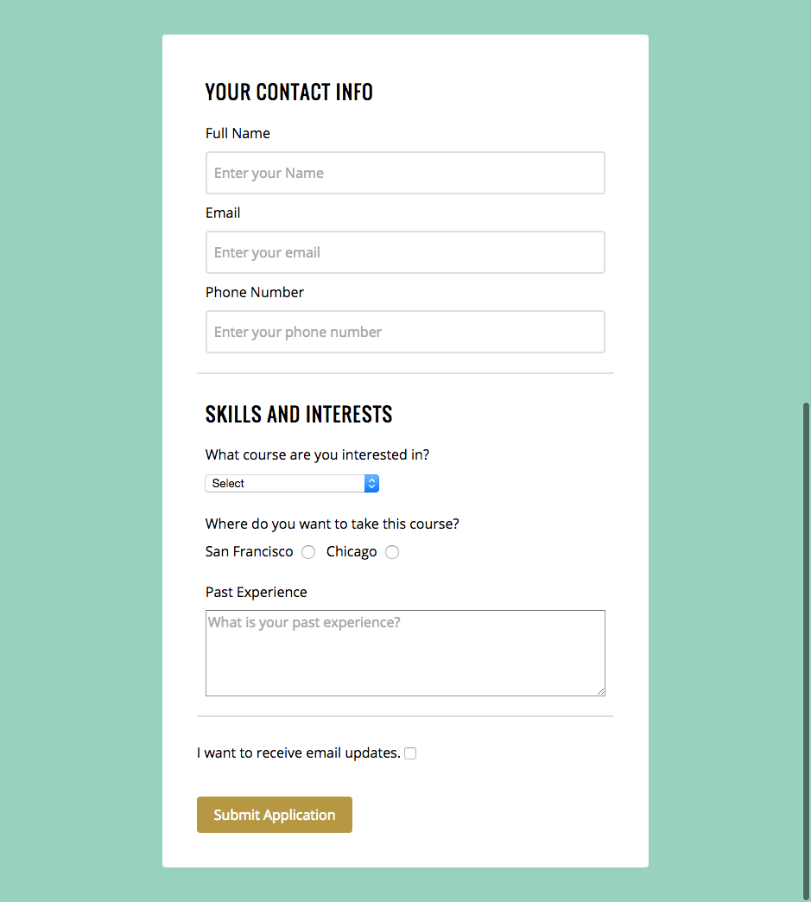

#  HTML Forms (90 mins)

| Timing | Type | Topic |
| --- | --- | --- |
| 10 mins | [Introduction](#introduction) | HTML Forms |
| 15 min | [Demo/Codealong](#demo) | Your First Form |
| 45 min | [Independent Practice](#ind-practice) | Application Form |
| x min | [Conclusion](#conclusion) |Topic |

### LEARNING OBJECTIVES
*After this lesson, you will be able to:*
- Create and style the following HTML elements: checkbox, radio buttons, text area/box, submit button, fieldset, label, and form
- Evaluate the proper usage of HTML form and input options

***

<a name="introduction"></a>
## Introduction: HTML Forms (10 mins)

## Why is this important?
*This workshop is important because:*

Forms are an important way a web application receive user input. The proper use of forms makes it easier to develop accessible websites with a good user experience.

### An Example `<form>` Element

```html
<form method="POST" action="/page">
  <input type="text" name="pageName" />
  <input type="submit" value="Create" />
</form>
```

### Attributes

In the opening of the `<form>` tag you can see two attributes: `method` & `action`

- **method**: the HTTP verb (method) that the browser uses to submit the form.
- **action**: the path of the HTTP request page that processes the information submitted via the form.

>A `route` is simply a combination of a method & action. For example `GET '/page'` or `POST '/users'` are both valid routes.

### POST vs GET
#### [POST](http://www.w3.org/Protocols/rfc2616/rfc2616-sec9.html#sec9.5)
- Data is not shown in URL
- Can contain sensitive data
- No size limitations
- Adds information to, or deletes info from a database


 #### [GET](http://www.w3.org/Protocols/rfc2616/rfc2616-sec9.html#sec9.3)
- Short forms (such as search fields)
- Appended to URL in name/value pairs
- Never use for sensitive info!!!
- Useful for form submissions when user wants to bookmark results
***

<a name="demo"></a>
## Codealong: Your First Form (# mins)
### Challenge: Doomed?

Create an html `form` that, on submit, sends the user to "hasthelargehadroncolliderdestroyedtheworldyet.com". Hint: what's the form action? Bonus: Can you change the submit button to say "Are we doomed?".

#### Solution

```html
<form action="http://hasthelargehadroncolliderdestroyedtheworldyet.com" method="GET">
  <input type="submit" value="Are we doomed!?">
</form>
```

**Client / Server Model**


## Common Inputs

| Field Type | HTML Code | Widget (Control) | Notes |
|:-- |:-- |:-- |:-- |
| plain text | `<input type="text">` | ![<input type="text">][text] | the type attribute can be omitted |
| password field | `<input type="password">` | ![<input type="password">][text] | echoes dots instead of characters |
| text area | `<textarea></textarea>` | ![<textarea></textarea>][area] | a more customizable plain text area |
| checkbox | `<input type="checkbox">` | ![<input type="checkbox">][check] | can be toggled on or off |
| radio button | `<input type="radio">` | ![<input type="radio" name="group"> <input type="radio" name="group">][radio] | can be grouped with other inputs |
| drop-down lists | `<select><option>` | ![<select><option>Option 1</option><option>Option 2</option></select>][select] | [check here for more info](https://developer.mozilla.org/en-US/docs/Web/HTML/Element/select) |
| file picker | `<input type="file">` | ![<input type="file">][file] | pops up an “open file” dialog |
| hidden field | `<input type="hidden">` |  | nothing there!
| submit button | `<input type="submit">` | ![<input type="submit">][submit] | activates the form's submission <br/>(a `POST` request or <br/>Javascript action) |

<!-- Images -->
[text]:   assets/text.png
[area]:   assets/textarea.png
[check]:  assets/checkbox.png
[radio]:  assets/radio.png
[select]: assets/option.png
[file]:   assets/file.png
[submit]: assets/submit.png

### Important Attributes

#### All input types (including `<textarea>`s):

- **`type`**: the type of data that is being input (affects the "widget" that is used to display this
  element by the browser).
- **`name`**: the key used to describe this data in the HTTP request.
- **`id`**: the unique identifier that other HTML elements, JavaScript and CSS use to access this
  element in the browser.
- **`value`**: the default data that is assigned to the element.
- **`placeholder`**: not a default value, but a useful HTML5 addition of a data "prompt" for an input.
- **`autofocus`**: defaults the cursor to a specific input when the page originally loads. You can only have one autofocus on your page.
- **`disabled`**: a Boolean (true/false) attribute indicating that the "widget" is not available for interaction.
- **`required`**: a Boolean (true/false) attribute indicating that the field must have a value / cannot be left empty.

#### Radio buttons or checkboxes:
- **`checked`**: a Boolean (true/false) that indicates whether the control is selected by default (is false unless checked).
- **`name`**: the group to which this element is connected. For radio buttons, only one element per group (or name) can be checked.
- **`value`**: the data or value that is returned for a specific group (a multi-element control), if this element is checked.

***

<a name="ind-practice"></a>
## Independent Practice: Application Form (45 minutes)
Review the following mockup and discuss your approach for building the form with a partner. Be sure to consider CSS during your discussion.



On your own:
- Write HTML for the form
  - You will need to look up the `textarea` element
  - Optional: Look up `fieldset` element
- Style the form with CSS. Focus on getting the form centered and getting the information on the right rows, and then add other styles if you have time.

> Instructor note: Solution code [here](solution-code).

***
<!-- SME Needed: Conclusion topics -->

<a name="conclusion"></a>
## Conclusion (# mins)
- Review independent practice deliverable(s)
- Recap topic(s) covered in today's lesson
- Cover homework and/or upcoming tasks

***

### ADDITIONAL RESOURCES
#### Videos
- [HTML Forms](https://www.youtube.com/watch?v=-5tH2qnTnH0&index=16&list=PLdnONIhPScST0Vy4LrIZiYKpFNoxgyH7J)

#### Readings
- [POST](http://www.w3.org/Protocols/rfc2616/rfc2616-sec9.html#sec9.5)
- [GET](http://www.w3.org/Protocols/rfc2616/rfc2616-sec9.html#sec9.3)
- [Select Element](https://developer.mozilla.org/en-US/docs/Web/HTML/Element/select)
- [HTML Form Reference](https://developer.mozilla.org/en-US/docs/Web/Guide/HTML/Forms)
- [HTML Input Reference](https://developer.mozilla.org/en-US/docs/Web/HTML/Element/input)
- [Native Form Widgets](https://developer.mozilla.org/en-US/docs/Web/Guide/HTML/Forms/The_native_form_widgets)
- [Inspiration for Text Inputs](http://tympanus.net/codrops/2015/01/08/inspiration-text-input-effects/)

#### Decks
- [HTML Forms Slideshow](assets/forms.pdf)
