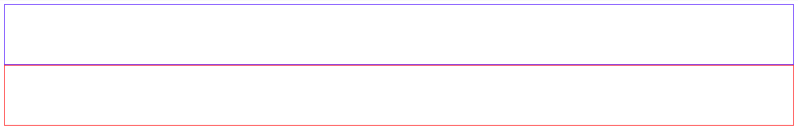
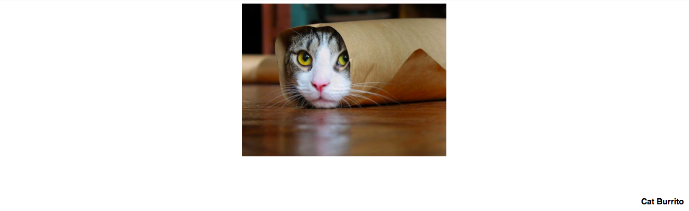
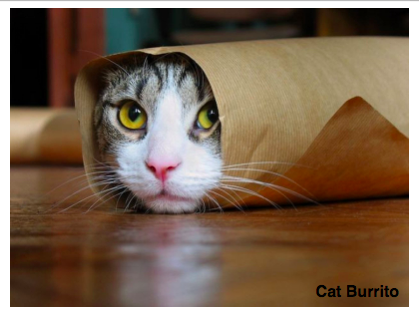
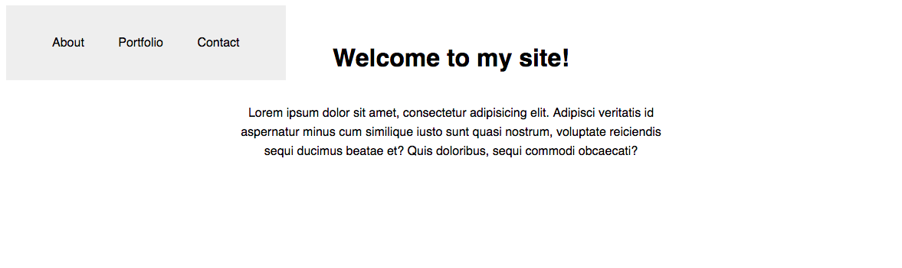
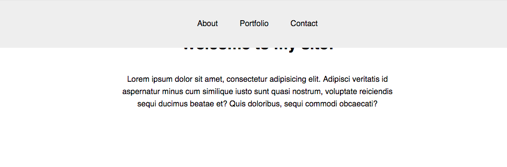
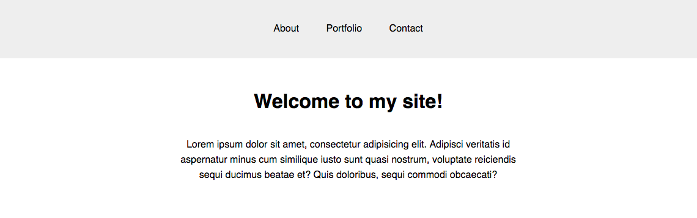

#  Positioning and Responsive Design (90 mins)

| Timing | Type | Topic |
| --- | --- | --- |
| 5 mins | [Introduction](#introduction-positioning) | Positioning |
| 15 mins | [Demo/Codealong](#demo-positioning) | Positioning |
| 10 mins | [Introduction](#introduction-rd) | Responsive Design |
| 20 mins | [Demo/Codealong](#demo-rd) | Responsive Design |
| 40 mins | [Independent Practice](#ind-practice) | Topic |

### LEARNING OBJECTIVES
*After this lesson, you will be able to:*
- Use layout techniques with width, min-width, max-width, vh and vw
- Use special selectors (descendant, adjacent sibling, direct child, universal)
- Understand and apply Image Optimization techniques like min-width, max-width, retina display, etc
- Identify breakpoints and apply media queries to adjust layout
- Understand the difference between mobile-up and desktop-down CSS
- Effectively use media queries to adjust and adapt your page layouts
- Understand how media queries work in the cascade
- Understand that Responsive Design is dictated by visual break points and not device sizes
- Explain the difference between and use cases of static, relative, fixed and absolute positioning

<a name="introduction-positioning"></a>
## Introduction: Positioning (5 mins)

The CSS `position` property is a way to build more complexity into your page layout; creating things like a sticky header that remains in place as the user scrolls, or text that appears on top of an image. Let's look at some examples.

***

<a name="demo-positioning"></a>
## Demo: Positioning (15 mins)
### Static
The default value of every element on is `static`. A `static` object receives its' layout rules from properties like `display` and `float`, and is considered an 'un-positioned' element. Any element that has a value other than `static` is referred to as a 'positioned' element.

### Relative
Using `position: relative;` is a way to position an element within the document flow, in relation to that elements original static position.

For example, let's place two divs on our page and view them in their natural document flow:

```html
<div class="first"></div>
<div class="second"></div>
```

```css
div{
  height: 100px;
}

.first{
  border: 1px solid blue;
}

.second{
  border: 1px solid blue;
}
```

# 

Looks like we'd expect. What if we set the second `div` to `position: relative;`?

# 

No change! This is because the element has not received any information on *where* it should be placed in relation to its natural position in the flow. We can give it specific instructions using the `top`, `bottom`, `right`, and `left` properties like so:

```css
.second{
  position: relative;
  top: -50px;
  left: 20px;
  border: 1px solid blue;
}
```

# 

Wow! The second `div` moved `-50px` from it's original `top` position in the flow, and `20px` away from it's original `left` position. To help make sense of the negative values, consider the element's starting `xy` position in the flow to be at `0, 0`.

### Absolute
An element that has been styled with `position: absolute;` will remove that element from the rest of the document flow, and position it in relation to the closest positioned element. (Remember that any element with a value other than `static` is considered positioned.) If there are no other positioned elements on the page, the `absolute` element will use the `<body>` as a reference object.

Because `position: absolute;` elements work in tandem with other positioned elements, you must set the reference element to `position: relative;`. Let's look at an example.

```html
<figure>
  
  <figcaption>Cat Burrito</figcaption>
</figure>
```

```css
  figure{
    width: 50%;
    margin: auto;
  }

  figcaption{
    position: absolute;
  }
```

# 

Similar to `relative` elements, the `absolute` element needs specific instructions on where it's meant to be positioned. Let's place the `figcaption` in the bottom right corner of the photo:

```css
  figcaption{
    position: absolute;
    bottom: 10px;
    right: 10px;
  }
```

# 

What did we miss? Our caption appears at the bottom right of the *page*, not our `figure` as we expected.

The answer:
```css
figure{
  position: relative;
  width: 50%;
  margin: auto;
}
```
That's right! We need to position either `figure` or `img` so the `<figcaption>` can be absolutely placed in relation to that element.

# 

### Fixed
A `fixed` element is not only removed from the document flow, but also stays in its position as the user scrolls on the page. A common `fixed` element is the `nav`. Let's see it in action. Here's the `nav` in its natural flow of the document.

# 

```html
<nav>
  <a href="#">About</a>
  <a href="#">Portfolio</a>
  <a href="#">Contact</a>
</nav>

<h1>Welcome to my site!</h1>
<p>Lorem ipsum dolor sit amet, consectetur adipisicing elit. Adipisci veritatis id aspernatur minus cum similique iusto sunt quasi nostrum, voluptate reiciendis sequi ducimus beatae et? Quis doloribus, sequi commodi obcaecati?</p>
```

```css
nav{
  background: #eee;
  padding: 40px;
}
```

What happens when we set the `nav` to `position: fixed;`?

# 

What happened? Let's break down the changes we're seeing.
- As we know, a `fixed` element is taken out of the document flow. This means it will position itself in the top left corner of the document.
- A `fixed` element also loses it's default `width` when it's removed from the document flow. We can easily rest it using the `width` property.
- It's also important that we remember the `top` and `left` properties to reinforce the `nav`'s position in the document.

```css
nav{
  background: #eee;
  padding: 40px;
  position: absolute;
  width: 100%;
  top: 0;
  left: 0;
}
```

# 

The `nav` looks correct, but it's hiding the rest of the page content! This is also caused by the `fixed` element being removed from the document flow. Simply move the other elements down using `margin` or `padding`!

```css
h1{
  margin-top: 100px;
}
```

# 

Great! Now we have a sticky `nav` that will stay at the top of the page while the user scrolls.

***

<a name="introduction-rd"></a>
## Introduction: Responsive Design (10 mins)

Responsive Design is the strategy of making a site that "responds" to the browser and device on which it's being displayed. This means a website is usable, readable, and looks great on any and all screen-sizes.

Or, the dryer Wikipedia definition:

Responsive web design (RWD) is a web design approach aimed at crafting sites to provide an optimal viewing experience—easy reading and navigation with a minimum of resizing, panning, and scrolling—across a wide range of devices (from mobile phones to desktop computer monitors).

### Responsive Design is **not** Device-Specific

A responsive site doesn't just look good on the newest phone, watch, tablet, or mega-screen– it looks good on *any* sized screen. This might seem impossible, but it's relatively straightforward. All that's required is writing a series of rules, called Media Queries, which check the size of the browser/device on which the site is being viewed, and adjust the CSS as needed.

### Media Queries

Media Queries are conditional style rules for the size of the browser/device rendering the site. Let's look at an example.

We already know that if we do something like this:

```css
p {
  color: red;
}

p.blue_text {
  color: blue;
}
```

By default, all p tags will have red text– unless they have the class blue_text, in which case, the text will be blue. We can do a similar thing with media queries.

```css
p {
  color: blue;
}

@media screen and (min-width: 600px) {
  p {
    color: red;
  }
}
```

Now, all p tags will be red, until the screen size reaches 600px, when they'll turn blue. How do we determine the pixel width to use in the media query?

### Breakpoints

The best approach to identifying the size of a media query is to test your site for breakpoints. A breakpoint is simply a specific browser width where the layout either breaks or no longer follows the intended design. Another way to think about it? The design looks 'off' or just plan bad!

You can use Chrome Dev Tools to measure the width of a page open in the browser. Adjust the width of the browser and identify breakpoints. If you see an unintended or unsavory change in design/layout, your media query should be set to the width of browser when the change occurs. These numbers will not typically be 'nice' or even like `1050px` but more likely seem random like `527px`.

What else do we need to get started?

### The Viewport Meta Tag!
We've seen some problems that can happen if we don't override some of the initial properties of a website. One of the properties we need to override is the viewport:

```html
<meta name="viewport" content="width=device-width, initial-scale=1">
```

This ensures that the viewport the same as the screen, and display at a natural zoom of 100%.

If you don't include this tag, the browser gets to choose the default viewport width and will not adhere to the correct media query style rules. In other words, a mobile browser might set its viewport width to `1080px` and display the layout meant for a screen that size.

Here's an example of a site that hasn't overridden the viewport: [http://www.tcgplayer.com](http://www.tcgplayer.com)


***

<a name="demo-rd"></a>
## Demo / Codealong: Responsive Design (20 mins)

So how can we make more impactful changes in our site using media queries? Let's look at a multi-column layout using `flexbox`.

<!-- SME NEEDED: demo with flexbox layout going from 3 columns to 2 to 1  -->


***

<a name="ind-practice"></a>
## Independent Practice: Topic (60 minutes)
<!-- SME NEEDED: repurpose this code for an independent practice exercise https://github.com/ga-wdi-exercises/learning-responsive-web-design  -->
***

## Hungry for more?
### Exercises
- [Build a Web  Comic](https://googlecreativelab.github.io/coder-projects/projects/comic_creator/)

### Videos
- [CSS Position](https://www.youtube.com/watch?v=zH8kjJdvmOs&list=PLdnONIhPScST0Vy4LrIZiYKpFNoxgyH7J&index=8)
- [CSS Responsive Design](https://www.youtube.com/watch?v=BsuCBmzLf_U&list=PLdnONIhPScST0Vy4LrIZiYKpFNoxgyH7J&index=21)
- [CSS Responsive Design - Media Queries](https://www.youtube.com/watch?v=GYygtVolViM&list=PLdnONIhPScST0Vy4LrIZiYKpFNoxgyH7J&index=23)
- [CSS Mobile First - min/max-width/height](https://www.youtube.com/watch?v=iQIj7Lu64M4&index=22&list=PLdnONIhPScST0Vy4LrIZiYKpFNoxgyH7J)

### Readings
- [The Lowdown On Absolute vs. Relative Positioning](https://codemyviews.com/blog/the-lowdown-on-absolute-vs-relative-positioning)
- [Responsive Web Design - An Original Introduction](http://alistapart.com/article/responsive-web-design)
- [Why You Don't Need Device Specific Breakpoints](https://responsivedesign.is/articles/why-you-dont-need-device-specific-breakpoints)
- [7 Habits of Highly Effective Media Queries](http://bradfrost.com/blog/post/7-habits-of-highly-effective-media-queries/)
- [Media Queries for Standard Devices](https://css-tricks.com/snippets/css/media-queries-for-standard-devices/)
- [Logical Operators in Media Queries](https://developer.mozilla.org/en-US/docs/Web/CSS/Media_Queries/Using_media_queries#Logical_operators)
- [A Tale of Two Viewports](http://www.quirksmode.org/mobile/viewports.html)
- [Responsive Design Pattern Examples](https://bradfrost.github.io/this-is-responsive/patterns.html)
- [Complex Navigation Patterns for Responsive Design](http://bradfrost.com/blog/web/complex-navigation-patterns-for-responsive-design/)
- [mediaqueri.es - a collection of responsive site examples](http://mediaqueri.es/)
