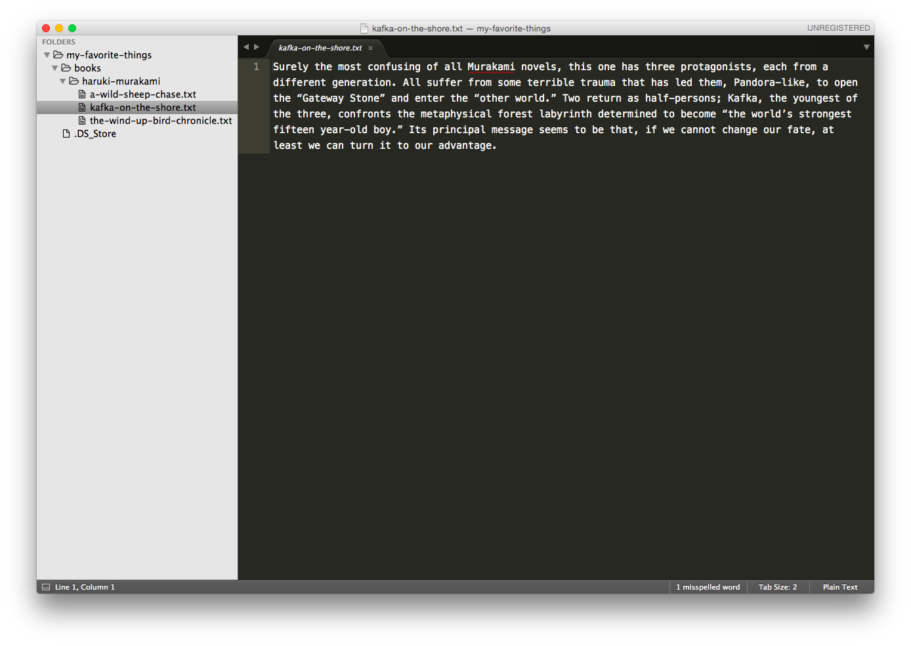
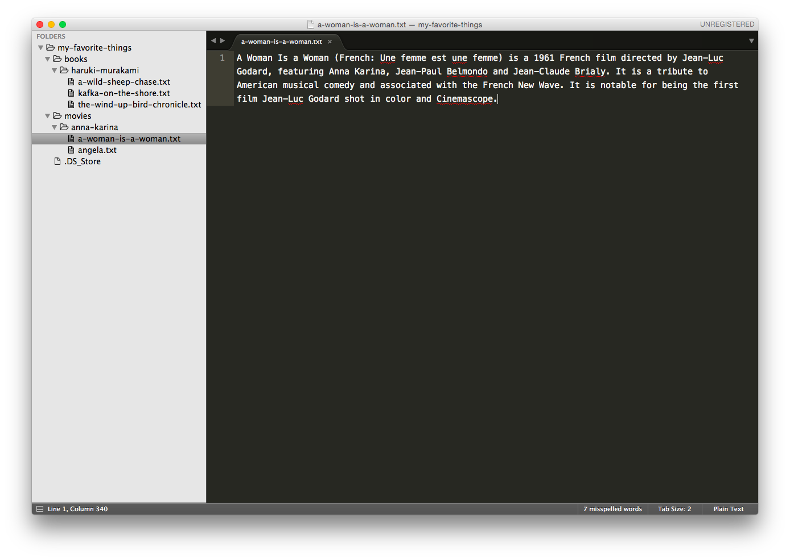
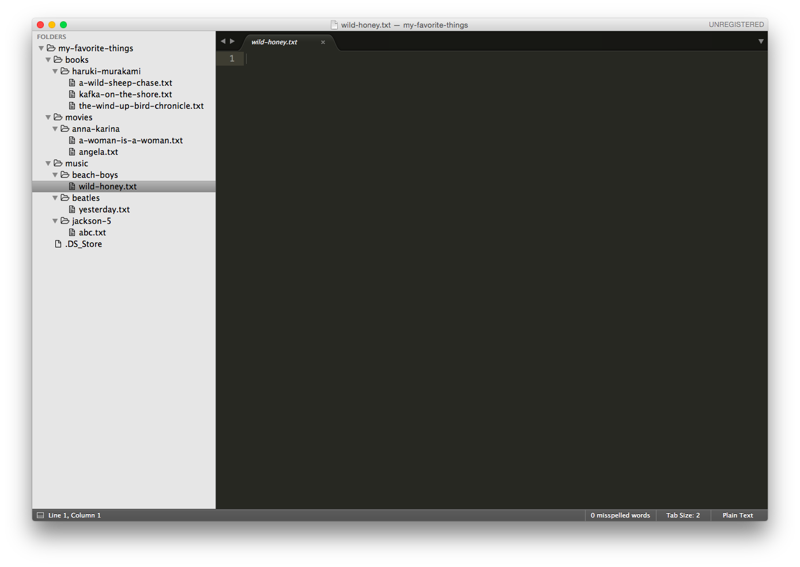
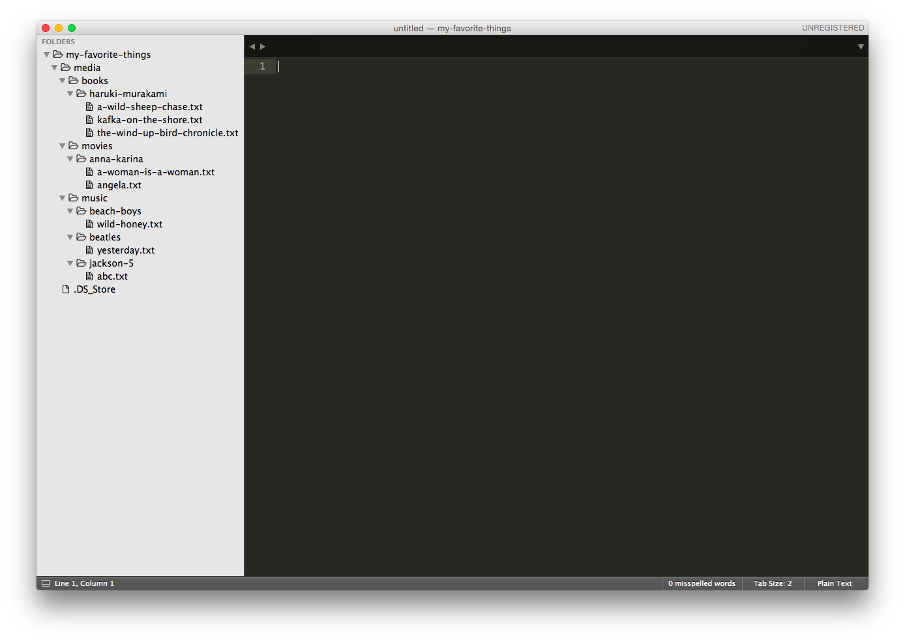

#  Command Line Practice

> ***Note:*** Developing any type of application requires a degree of comfort navigating and interacting with your operating system through the command line. We'll be practicing creating, modifying, and moving files and folders in your terminal to get you familiar with Unix commands.

> For your first homework assignment, you're going to create files and folders to organize your favorite books, movies, and music - then, you're going to reorganize them.

> Be sure to use the cheatsheets in the "Resources" section if you get stuck.

## Exercise

#### Requirements
- All files/folder should be created/copied/moved/etc. following the instructions below and using the following Terminal commands:
  - Navigate from folder to folder using `cd`.
  - List files using `ls`.
  - Create new directories using `mkdir`.
  - Create new files using `touch`.
  - Move files using `mv`.
  - Copy files using `cp`.
  - Remove directories using `rmdir`.
  - Remove files/directories that contain items using `rm -rf`.
- Text should be added to files using Sublime or Atom
- Progress should be tracked by comparing your file/folder structure in your code editor to the images supplied under "Deliverable."
- Submit 2-5 questions that you would like addressed regarding this homework.

#### Instructions

- From your root directory, create a folder called "my-favorite-things"; you'll use that folder to do the exercises below

- Organize your favorite books
  - In the "my-favorite-things" folder, create a folder called "books" and navigate to that folder.
  - In the "books" folder, create a folder named after your favorite author (e.g. "mark-twain", or "haruki-murakami". Use dashes between words instead of spaces!)
  - Create files named after some of the author's books in the author's folder (e.g. "the-wind-up-bird-chronicle.txt")
  - Navigate back to the my-favorite-things folder and list the contents in terminal (using `ls`)
  - Open the my-favorite-things folder in atom/sublime (Pro tip: you can use the `subl .` command in terminal to open the current directory in Sublime.)
  - In Sublime, edit each file to put a brief description of the book

- Organize your favorite movies

  - In the "my-favorite-things" folder, create a folder called "movies" and navigate to that folder.
  - In the "movies" folder, create a folder named after your favorite actor
  - Create a folder in the actor folder named after the actor's breakthrough movie (e.g. 'a-woman-is-a-woman.txt')
  - Look back at Sublime/Atom and edit that text file with a description of the movie
  - Navigate back to the "movies" directory. Create a text file named after the actor's character in the "movies" directory.
  - Move the text file to the breakthrough movie's folder

- Organize your favorite music

  - In the my-favorite-things folder, create a folder called "music"
  - Navigate to the "music folder"
  - Create a folder called "disco"
  - Create a text file in "disco" called "ymca"
  - Delete the "disco" folder
  - Create folders called "beatles", "beach-boys", and "jackson-5" (pro tip: Look up how to create three folders at once!)
  - Create a text file in "beatles" called "yesterday.txt"
  - Make two copies "yesterday.txt" - one into "beach-boys" and one into "jackson-5" and rename those files with songs by those artists

- Reorganize _everything_

  - In the my-favorite-things folder, create a folder called "media"
  - Move "books", "movies", and "music" into the "media" folder

#### Bonus

- Look through the additional resources and do the following

  - Look at the top/bottom 10 lines of each file
  - Figure out how search through a file from the command line - without opening the file - for a string of text
  - See if you can figure out how to open a file and add text content in the command line instead of using Sublime or Atom to add the text.

#### Starter code

No starter code needed! Just open up your Terminal application to get started.

#### Deliverable

Be sure you open up your "my-favorite-things" directory in Sublime/Atom, so you can track your progress. Here's a look at what your files/folders should look like after each big step in the exercise:

- After "Organize your favorite books":

- After "Organize your favorite movies":

- After "Organize your favorite music":

- After "Reorganize _everything_"

## Resources
- A list of [CLI Shortcuts](https://gist.github.com/alexpchin/01caa027b825d5f98871)
- An awesome Unix command [cheatsheet](https://github.com/veltman/clmystery/blob/master/cheatsheet.md)

## Additional practice
- [CLI Gardening](https://github.com/ga-dc/cli_gardening)

## Hungry For More?:
- Try to complete the [Kitchen Organizer](labs/kitchen/README.md) lab in as few steps as possible. Look up shortcuts along the way!
- Practice using other popular commands that were not covered in class by completing the [Command Line Fu - Challenge](https://github.com/ga-wdi-exercises/command_line_fu) lab.
- Brownie points for configuring your terminal using [https://www.iterm2.com/](iTerm). Find some helpful instructions [here](http://yoderbacon.com/blog/2014/10/22/how-to-customize-iterm/).
- Practice using these [CLI Shortcuts](https://gist.github.com/alexpchin/01caa027b825d5f98871)
