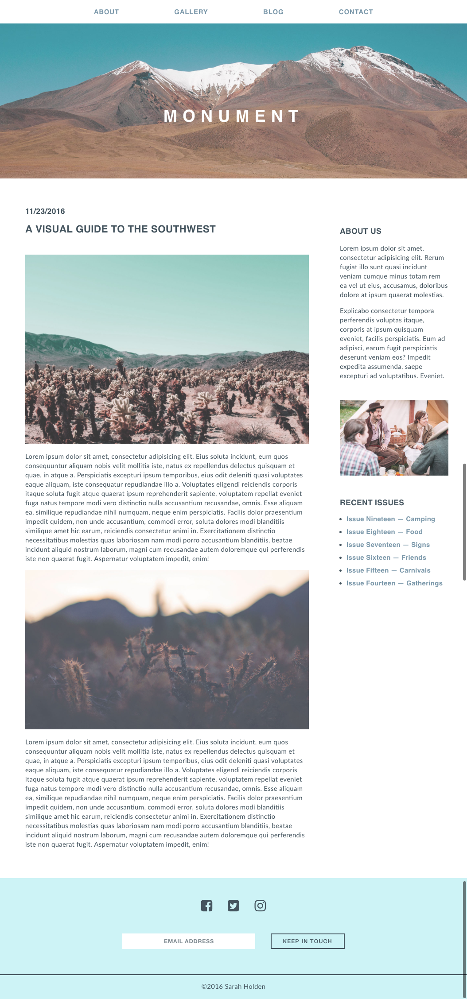
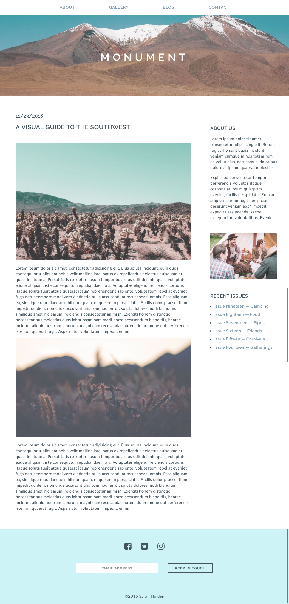

#  Monument - Part 2

## Exercise

In this homework assignment, you will continue to build out the Monument Magazine Blog page. For this assignment you will be updating the layout using padding, margin, borders, and Flexbox.

#### Requirements

- Use Flexbox in your CSS to achieve a two-column layout
- Use inline-block to align other elements next to one another (such as the anchors in the nav)
- Add a background image to the header
- Use [FontAwesome](http://fontawesome.io/) icons for Facebook, Twitter and Instagram in the footer.
- Use indentation in your HTML and CSS files to make your code readable.
- Use [HTML](https://html5.validator.nu/) and [CSS](https://jigsaw.w3.org/css-validator/#validate_by_input) validators to check for errors before submitting.
- Include [browser prefixes](http://pleeease.io/play/) to make sure that newer CSS properties render consistently in different browsers.

#### Bonus Tasks
- Google and implement Google Fonts (Fonts are specified in bonus mockup below).
- Make the nav "sticky" (fixed) as the user scrolls.
- Add a hover effect to the links and buttons using pseudo-classes.

#### Starter code
You will continue working from the project you started last night.

#### Deliverable

##### Mockup:

##### Mockup with Bonus Tasks:

##### Bonus Task - Sticky nav

##### Bonus Task - Hover effect

## Hungry For More?:
- Some extra ideas for medium/advanced students
- Another thing that would be good for you to practice
- Brownie points for doing X, Y, Z
