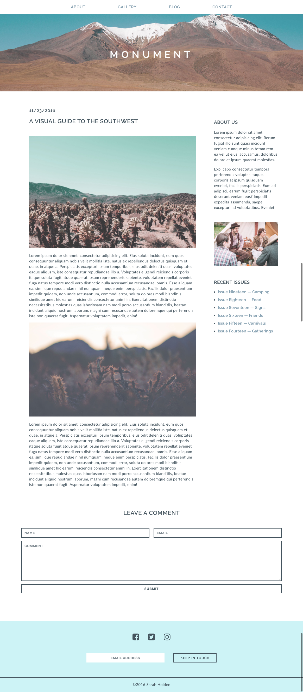
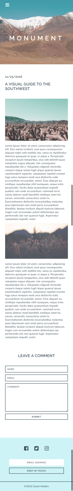

#  Monument - Part 3

## Exercise

Congratulations! You're almost done with the blog page for Monument Magazine. Today you will be continuing to build up the site by adding in a simple contact form and making the site responsive. Are you ready?

#### Requirements

- Add the HTML/CSS to create the contact form that is shown in the design mockup.
- Add a media query to update the layout and styles for screens size 560px and below.
- Be sure content remains in appropriate divs
-Fonts change size appropriately
- Margins and padding should change size appropriately
- Content should not overlap
- For the articles, the two-column layout changes to a single-column layout when appropriate.
- Form inputs should include the appropriate `type` attribute along with a `name` attribute
- All input/textarea elements should be wrapped in a `form` element.
- Use the appropriate Google Fonts to style the text on the page.

#### Bonus
- Evaluate the page in your browser and consider what layout/style updates could be made for medium (tablet) sized screens (around 775px and below).
- Implement these updates by adding an additional media query (or queries).
- Look up the transition property and add transitions to any elements that have a hover effect.

#### Starter code

You will continue working from your project from the last two days.

#### Deliverable

Larger screens:

Mobile screens:

## Hungry For More?:
- Some extra ideas for medium/advanced students
- Another thing that would be good for you to practice
- Brownie points for doing X, Y, Z
