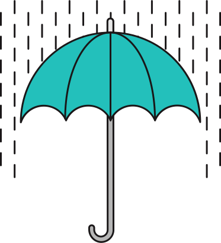

> #### *Guiding Questions When Using This Template*
>
> - [ ] Are the learning objectives measurable?
>   - [ ] Are there at least two objectives? ( All learning objectives should be pulled from the [Front End Standards](https://docs.google.com/spreadsheets/d/11SzdbIIa9PLJ6kknGXXoBYOtL5ycwMK2N8lkI5THFak/edit#gid=1968474545) doc.  If you would like to add or remove any Learning Objectives, please contact amy.almeida@ga.co)
>   - [ ] Does the lesson address all the learning objectives?
>
> - [ ] Are activities spaced out with enough time for each?
>   - [ ] Did you include knowledge "Checks" or activities at the end of every component to test comprehension?
>   - [ ] Is there an even distribution of intructor-led and active learning portions?
>
>
> - [ ] Did you provide guidance for both students & instructors?
>   - [ ] What will instructors have to do to prepare for this lesson?
>   - [ ] What will students have to do to prepare for this lesson?
>   - [ ] What additional resources do you provide for students who are "hungry for more," or need additional practice?
>
> #### *How to Use This Template*
> * Static Components: Reserve roughly 5 min for Opening, 5 unscheduled "buffer" mins for overrun, & at least 5 min for Conclusion (end of lesson review).
>
>
> * Modular Components: The units of instruction are: Intro, Demo, Guided-Practice, & Independent-Practice. These can be cycled or intermixed in various orders, depending on the topic / content.

> #### *Components of the lesson plan*

> - Opening: this only happens once; used to introduce the agenda, review material, and provide a motivating example / the problem we're trying to solve with this skill/content
> - Introduction: this is a section dedicated to introducing and contextualizing new vocabulary, ideas, and code syntax that will be practiced in later sections
> - Demo: an instructor-led session demonstrating proper techniques or syntax examples
> - Guided Practice: interactive instructor by which the instructor engages with and probes students for answers to guide the discussion or activity
> - Independent Practice: a block of time where students are able to practice what they've learned; the instructor provides directions and the students use the directions to complete an exercise
> - Conclusion: a time to sum up the lesson, review the answers to a final independent practice, and/or pose discussion questions
> - Check: a moment to check to understand students are following; it can be done with a question about content, a general "How comfortable are you with this?", or the instructor can check the output of students code to ensure they've completed the assignment properly.

> NOTE: the lesson you create does not have to follow a progression of Introduction > Demo > Guided Practice > Independent Practice - a combination of these is often ideal - but a lesson must always begin with an Opening and end wth a Conclusion.


---
#  Mastering Control Flow (90 mins)

| Timing | Type | Topic |
| --- | --- | --- |
| x min | [Introduction](#introduction) | Topic |
| x min | [Demo/Codealong](#demo) | Topic |
| x min | [Guided Practice](#guided-practice) | Topic |
| x min | [Independent Practice](#ind-practice) | Topic |
| x min | [Conclusion](#conclusion) |Topic |

### LEARNING OBJECTIVES
*After this lesson, you will be able to:*
- Differentiate between true, false, 'truth-y', and 'false-y'
- Use if/else if/else conditionals to control program flow based on boolean conditions
- Use switch conditionals to control program flow based on explicit conditions
- Use comparison operators to evaluate and compare statements
- Use boolean logic (!, &&, ||) to combine and manipulate conditionals

### STUDENT PRE-WORK
*Before this lesson, you should already be able to:*
- Describe some concept
- Explain how to do something
- Do or build something

### INSTRUCTOR PREP
*Before this lesson, instructors will need to:*
- Create variables in JavaScript
- Differentiate between data types (strings, numbers, booleans)
- Use a text editor
---
<a name="opening"></a>
## Opening (5 mins)
- Review pre-work, projects, or exit ticket, if applicable
- Review current lesson objectives
- Reference general course content or topics (e.g. code or concepts that have been used across multiple lessons)
- Include Hook / Real-world Relevance (why the content from this lesson is useful or important)

What is control flow? Watch this [video](https://generalassembly.wistia.com/medias/zhahjd0c7t) to discover more about the role control flow plays in development.

JavaScript supports a compact set of statements, specifically control flow statements, that you can use to incorporate a great deal of interactivity in your application.

<a name="comparison-logical"></a>
## Introduction: Comparison and Logical Operators (10 mins)


#### Intro to Conditions
Comparison and logical operators are useful in JS because they help us compare different conditions to one another.

**Conditions** are usually made up of a mathematical statement that uses an operator (the signs that allow us to make the comparison, such as equals, less than, or greater than).

Conditions are statements that make comparisons that evaluate to true or false in order to control the flow of the program.

Take a look:

```js
if (score > 50) {
  console.log("Congrats! You've passed this level.")
}
```

Here the condition is the comparison that is within the parentheses:

```js
score > 50
```

#### How Conditions Are Used
When information is incorrect, JavaScript can help identify the comparison as false.

So if you're filling out a form that requires your birthday, you can't say you were born in the year 2045 because that year hasn't occurred yet.

You also can't say that you were born on December 45th, because that day doesn't exist.

When you try entering information like this, JS will identify that it is wrong by comparing the information you entered against information it knows to be accurate.


Making comparisons is almost like asking questions about the information the user has entered.

Is the year less than or equal to 2016 and more than or equal to 1900? If the answer to this question is "true," then we know the user has entered a valid year, and that he or she was born somewhere between 1900 and 2016.


Did you notice how we used the term "less than or equal to" to check, or compare, two things? This is how our comparison operators help us make decisions.


## Guided Exercise: Comparison Operators (15 mins)

Comparison operators are binary in that they compare two values against one another and return a boolean value — either true or false.

Comparisons in JavaScript can be made using <, >, <=, and >=, and work for both strings and numbers.


<!--
ID NEEDED: Help formatting the following exercise

Type each command given in the console below. Before you press enter, take a moment to think about what value the console will return.

7 > 7
The console returns false.
7 >=7
The console returns true.
7 < 7
The console returns false.
7 < 13
The console returns true.
7 <= 13
The console returns true. -->


#### Equality Operators

Now let's take a look at equality operators (these can be a bit more complex).

Equality operators check to see whether two values are the same as, or equal to, one another.

There are two ways to verify equality in JavaScript:

The `==` operator or the `===` operator. In this course, we will always use the `===` operator, because it is more accurate.


#### `==` Equals Operator

First let's take a look at the `==` operator.

While verifying equality using the double equal (`==`), JavaScript performs something called "type coercion".

Type coercion means that, if the values on both sides of the equality operator have a different type (e.g., the number 1 and the string "1"), JavaScript will try to change the type of both operands to check whether or not they are equal.
<!--
ID NEEDED: Help formatting the following exercise
Type each command in the console. Before you press enter, take a moment to think about what value the console will return.

7==7
The console returns true
7=="7"
The console returns true
-->


Note that the second statement evaluates to true, even though we are comparing a number and a string.

#### Type coercion

So why is that?

This is because behind the scenes, JavaScript is trying to convert the values before comparing them.

```
7 == 7    // true
7 == "7"  // true
```

Here, the interpreter (aka, the console) would first try to convert 7 to a string ("7") and then compare "7" with "7".

Because those values are equal, this would return `true`.

Because JS tries to change an expression so that both types are equal, it's easier for expressions to return true. If we're not careful, this can cause some unexpected (and unwelcome) behavior.

#### The Strict Equals Operator `===`

To avoid type coercion and ensure stricter comparisons, use the triple equals operator, also known as the Strict Equality Operator (===).

The === operator checks to make sure the type and the value on both sides of the === are the same.


Now, let's take a closer look at the answers:


The double equals signs (==) can be useful when both the type and value are the same, but, because their type coercion could potentially derail your program, they're best avoided when you're just getting started out.

By sticking to the === operator, we can ensure that we are checking both the type and the value.

#### The Not Equals Operator `!==` and `!=`
Now, what do we do if we want to check and see if two values are not equal to one another?

These areWe use the inequality operators (`!=` and `!==`).

The `!=` operator checks to see if two values are not equal to one another. Similar to the `==` operator, it performs type coercion before checking the two values against one another.

The `!==` compares two values to one another without performing type coercion, so both the values and the types are compared.

<!--
ID NEEDED: Help formatting the following exercise
Type each command in the console. Before you press enter, take a moment to think about what value the console will return.
7 === 7
The console returns true.
7 === "7"
The console returns false.
0 === false
The console returns false.
false === "false".
The console returns false.
7 !== 7
The console returns false.
7 !== “7”
The console returns true.
0 !== false
The console returns true.
false !== “false”
The console returns true.
 -->


## Logical Operators (5 mins)
Finally, let’s have a look at *logical operators*. The logical operators are NOT, OR, and AND.

We can use these to combine several boolean statements into a single statement.

For instance, if it is raining **AND** I have an umbrella, then I will go outside with an umbrella.

BOTH conditions have to evaluate to true for the entire expression to be true.



Logical operators let us check to see if two conditions are both true or if _at least one_ of the conditions is true.

We can also use logical operators to reverse a value or check to see whether or not something is false.


<br>
NOT (`!`) will reverse the value of any Boolean (i.e, `!true` `// false`).

OR (`||`) takes in two boolean arguments; if at least one is true, then it will evaluate to true. But, if both are false, it will evaluate as false.

AND (`&&`) also takes in two boolean arguments; however, it will only evaluate as true if both of the arguments are true. Otherwise, it will evaluate to false.


For example, let’s assume that a = 5, b = 10, and c = 8.

Is the following condition true?

```js
a < b && a < c

```

Yes. 5 is less than 10 AND 5 is less than 8.

Once we check multiple conditions to see if they’re true, we can do something with the results.

## Truthy and Falsey (15 mins)
Like most computer languages, JavaScript supports Boolean values, or True/False values.

Everything in JavaScript — from the strings we learned about in Unit 1 to the null and undefined values we just covered — has an inherent Boolean value, generally known as either _truthy_ or _falsey_.

#### Truthy
Something is truthy when it evaluates to True. In JavaScript, truthy values include:

- Strings
- Non-zero numbers
- True

#### Falsey
Something is Falsey when it evaluates to False. The "falsey" category of values includes:

- False
- 0 (zero)
- "" (empty string)
- Null
- Undefined
- NaN (a special Number value meaning Not-a-Number!)


#### Summary
Below are the exact rules Boolean operators follow when dealing with non-Boolean input values.


The best way to determine if something is truthy is to determine that it’s not falsey.

As you saw in the table, there are six Falsey values in JS:

`undefined`, `null`, `NaN`, `0`, `""` (empty string), and `False`, of course.
<br>
<br>
#### Logical Operators and truthy/falsey values
Earlier, we looked at the logical operators NOT(`!`), OR (`||`), and AND (`&&`).

These operators accept inputs with data types such as strings and numbers.

When operators accept input values, they categorize these inputs as being either "falsey" or "truthy."

The boolean operators `!`, `||`, and `&&` follow a set of rules that determine how they behave.

NOT(`!`): If the input is truthy, return `false`; if the input is falsey, return `true`.

OR (`||`): Return the first truthy value; if both values are Falsey, return the last falsey value.

AND `(&&):` Return the first falsey value; if both values are truthy, return the last truthy value.

Let’s take a closer look:

```js
7 >= 7 && 12 < 8
```

The logical operator (in this case, `&&`) will categorize the inputs on each side as either falsey and truthy:

truthy (`7 >= 7`) && falsey (`12 < 8`)

Now, we'll see what happens with different input types:

```js
"Hello Dolly" && 7
```

Again, the logical operator (&&) will categorize the inputs on each side as either falsey and truthy:

```js
truthy ("Hello Dolly") && truthy (7)
```

See how the values were converted to truthy/falsey and then compared? “Hello Dolly” evaluates to true, as it's a non-empty string, and 7 also evaluates to true, as it's a number that's not 0.


#### Exercise

Can you predict how the following expressions will be evaluated?

Try typing each expression into your console in Chrome.


<!--
ID NEEDED: Help formatting the following exercise
!('')
The console returns true.
false && undefined
The console returns false.
true && !0
The console returns true. -->


<!-- @sarahholden Insert video: Truthy and falsey -->

Let's review the concept of truthy and falsey by watching this short [video](https://generalassembly.wistia.com/medias/jdz1fp4ys8)


## Conditional Statements (25 mins)

Now we’re going to learn a bit more about conditional statements and how we can use them to control the flow of a program.

Take a look at this short [video](https://generalassembly.wistia.com/medias/afk2hatfe0) that describes how conditional statements tie in with the material we just covered.

We can use a conditional statements to skip over a block of code if it does not pass a boolean expression.

Let’s say our condition is `7 > 5`.

This is an example of a condition that the interpreter will know as either true or false.

Once we have this type of condition, we can add in our conditional statements to take one path if the condition is true and another if the condition is false.

Take a look, and see if you can pinpoint where the operators we learned about in the last lesson come in handy:

```js
if (condition) {
  // Take one path
} else {
  // Take another path
}
```

```js
if (7 > 3 && 1 < 5) {
  // Take one path
} else {
  // Take another path
}
```

#### `if...else` statements

Let’s start by looking at `if...else` statements.

As you may have guessed from its name, the first component of the `if...else` statement is the *if statement*.

An *if statement* allows us to check whether or not a condition is true and, if it is, run our code.

The conditional below is an `if` statement.

An `if` statement will take in a condition and, if that condition is truthy, run whatever code you specify.


#### Flow Charts
You're probably already familiar with a common real-world application of the `if` statement: the *flow chart*.

A *flow chart* is a visual diagram that tells us how to behave depending on a certain set of conditions.


If we were to draw a flowchart to describe the following if statement:


```js
if (x > 10) {
  x += 10;
  y += 10;
}
```

We might come up with something like this:

As you can see, a person making their way through this diagram would need to make a decision.

Depending on whether or not our condition is truthy, he or she would either enter the block of code or skip over it entirely.


#### Else If Statements
Adding an `else` to our `if` statement allows us to specify a second condition to test.

However, this second condition will *only* be tested if the first condition fails.

For example, let's say we want to offer both a senior discount and a student discount for movie tickets:

```js
if (age < 18) {
  console.log("Student discount applied");
} else if (age > 65) {
  console.log("Senior discount applied");
}
```

Notice how we are now able to check to see if multiple conditions are true.

We can add as many `else if` statements as we want. You just keep tacking them on.

These statements allow us to add complex logic to our program, which can check for multiple conditions and specify an action for each result, making our program seem more intuitive and user friendly.


#### Else Statements

At this point, if none of the conditions we check for are true, then nothing will happen.

We need a way to check several conditions and have the ability to move forward if none of these conditions are true — a default, or fallback, course of action.

To specify behavior for this outcome, we must add an `else` to the end of our statement.

Let's look at an example of an else statement:


#### Exercise

Imagine you work the information booth at a theme park and help recommend rides to guests.

If a person is less than 8 years old, recommend the merry-go-round.

Else if a person is more than 8 years old and less than 65 years old and more than 4.5 feet tall, recommend the roller coaster.

Else recommend the lazy river.

Try typing this out in your console.

Sample solution:

```js
var age = 25;
var height = 5;
if (age <= 8) {
  console.log("Check out the Merry-Go-Round. You'll love it!");
} else if (age > 8 && age < 65 && height > 4.5) {
  console.log("Check out the Roller Coaster. It's awesome!");
} else {
  console.log('Why not enjoy a float down the Lazy River?');
}
```
#### Note: Assignment vs. Comparison Operator
Within our conditions, we will often need to check to see whether or not two values are equal to one another, and perform an action based on the results.

Example:

```js
if (result === true) {
  // Congratulate the user on passing
}
```

Notice that we used a triple equals instead of a single equals in the condition.

This is important to note, as confusing the assignment operator with the comparison operator is a common mistake for beginners.


Remember: An *assignment* is when we give a variable a value.

A *comparison* checks the relationship between two values.

A single equals sign is reserved for assigning a value to a variable, whereas a triple equals sign can be used to compare two values.

Take a look at the following example:

Here, we are not comparing x with the number 3. We're assigning the variable x the value of 3 by using = instead of ===.

```js
if (x = 3) {
  console.log("boo");
}
```

If we wanted to see if x is equal to 3, we would use a comparison operator (the triple equals sign):

```js
if (x === 3) {
  console.log("boo");
}
```


#### Conditionals Summary
Let’s turn to a summary of conditionals and test ourselves with a short quiz.

Using if...else statements allows us to write code that can behave very differently in different circumstances.

Consider the following conditional statement:

```js
if (x > 5) {
  y = 50;
} else if (x < 5) {
  y = 33;
} else {
  y = 100;
}
```

- What value will be assigned to y if x is 10?
  <!-- Answer: 50 -->
- What value will be assigned to y if x is 4?
  <!-- Answer: 33 -->
- Under what circumstances will y be assigned a value of 100?
  <!-- Answer: x=5 -->


## Fizz Buzz (15 minutes)

Fizz buzz is a game about division. Create a program that will iterate through numbers from 1 to 101 and log each number in the console.

- In the loop every time a number is divisible by **3**, instead of logging the number itself, the word "fizz" should appear.
- If the number is divisible by  **5**, the word "buzz" should be logged.
- If the number is divisible by both **3** and  **5**, then the word "fizzbuzz" should be logged.

Hint: Go read about the [Remainder Operator](https://developer.mozilla.org/en-US/docs/Web/JavaScript/Reference/Operators/Arithmetic_Operators) on MDN and figure out how to use it to simplify this problem.

A typical output in the chrome dev tools would look like this:


#### Solution

## Conclusion (5 mins)
These are just some of the foundational tools you'll use while building your applications with JavaScript.

You'll probably need to refresh yourself on the exact syntax a few times before you memorize it, but it's important to be able to remember these core "control flow" concepts in general, as they'll come up in pretty much every programming language you'll ever encounter.

***

### BEFORE NEXT CLASS
|   |   |
|---|---|
| **HOMEWORK** | Example Assignment [#](Instructions)  |
| **UPCOMING PROJECTS**  | Project Assignment: Title [#](Instructions)  |

### ADDITIONAL RESOURCES
- Exercises
- Videos
- Readings
- Decks

> Instructor Note: When possible, provide a brief description of Additional Resources, classifying whether it is for advanced or beginner students.  
