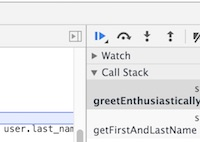

<!--

SME NEEDED (1 - 1.5 hour estimated)

Currently there is one lesson for debugging JS (under WDI Curriculum), but we are building out 2 90 minute lessons.

Current resources:

- WDI Lessons: https://github.com/ga-wdi-lessons/js-debugging
- WDI Curriculum: https://github.com/GA-WDI/curriculum/tree/master/resources/00-programming/js-debugging-lesson


Right now I've placed a lot of the content from WDI lessons here as a "Debugging JS Part 1" and the other content (WDI Curriculum) as a "Debugging JS Part 2" for day.

For Debugging part I here's what students have learned: 
- Variables / Data Types
- Arrays 
- Loops *** Could be super helpful!
- Objects

For Debugging Part II students will also have learned:
- Objects
- Basic Vanilla JS DOM Manipulation
- Vanilla JS Events

WHAT'S NEEDED:
1. Check flow of two lessons, make sure it makes sense, modify/rearrange if needed, add content if needed (shouldn't be too much that needs to be added, maybe screenshots)
2. A 20-minute lab for Debugging Part I (See below)
3. Starter code/solution for Part II (Week 2 Day 5) needs to be reviewed and modified if needed and instructions should be fleshed out a bit.

-->
#  Chrome Dev Tools and Debugging JS (90 mins)


<!--ID NEEDED: Filling out this table, jump links. Thanks!-->

| Timing | Type | Topic |
| --- | --- | --- |
| x min | [Introduction](assets/#introduction) | Topic |
| x min | [Demo/Codealong](assets/#demo) | Topic |
| x min | [Guided Practice](assets/#guided-practice) | Topic |
| x min | [Independent Practice](assets/#ind-practice) | Topic |
| x min | [Conclusion](assets/#conclusion) |Topic |

### LEARNING OBJECTIVES
*After this lesson, you will be able to:*

- Identify and resolve common and uncommon "logical errors" that affect the results of your program.
-  Use logs to troubleshoot errors in an application.
- Conduct real-time debugging in the browser.
- Differentiate between syntax, reference, and type errors.

### STUDENT PRE-WORK
*Before this lesson, you should already be able to:*

- Create variables in JavaScript
- Differentiate between data types (strings, numbers, booleans)
- Use `if/else if/else` conditionals to control program flow based on boolean conditions
- Create arrays and access/manipulate elements in arrays


---
<a name="opening"></a>
## Opening (5 mins)
- Review current lesson objectives

Oftentimes, the toughest part of troubleshooting is identifying the
exact cause of the problem.

In this course we'll aim to teach you to identify and decipher errors.

What does it mean to have an error in JS?

Errors don't just happen. Chrome doesn't just "break". In fact, it's not Chrome that's throwing the error at all: it's Javascript.

Whenever you run into an error, it's because somewhere in the code you're running or in Javascript's source code there's a line that says, "When this happens, throw an error."

#### What's an Error?

Let's see how to throw an error.

Here's a piece of HTML/JS that manually "throws" an error...

```html
<!DOCTYPE html>
<html>
  <head>
    <title>JS Errors</title>
    <script>
    throw(new Error("Oh, noes."));
    console.log("Such is life.");
    </script>
  </head>
  <body></body>
</html>
```

The result:

```
Uncaught Error: Oh, noes.       index.html:6
```

Note that the line with `console.log("Such is life.")` will _never run_. This is one of the things that can make writing JavaScript frustrating at first. One little error in your code can prevent any of your code from running!

> **Note**: Don't worry too much about the syntax of how to throw an error, you won't be creating your own custom Errors very often in this class, we're just showing this to you so you know what "magic" is going on under the surface.

## Common Errors (10 mins)

Now that we know a little bit about what an Error is and when it is thrown, let's look at some of the most common errors that you will run into in JS.

#### Independent Practice: Encountering Common Errors in JS

For the following exercise:

1. Open Chrome
2. Open Dev Tools (right click, "inspect")
3. Open the console tab


Take 5 minutes to independently work through this exercise.

You will first copy the code under each step and paste it into the console, and then hit enter.

You should see an error message with a description of the error added to the console when you do. 

For each step, fix the error and then run the code in your console again until the code for that step is error-free.

1.

```js
var myString = "awesome";

function printString (str) {
  console.log(str);
}

printString(str);
```

2.

```js
var total = 0;

var cashRegister = {
  addToTotal: function (amount) {
    return total + amount;
  }
}

total = cashRegister.add(4);
```

3.

```js
function shoutLongWords (word) {
  if (word.length > 5)
    console.log(word.toUpperCase());
  } else {
    console.log(word)
  }
}
```

## Reading Error Messages (10 mins)

Javascript has [7 error types](https://developer.mozilla.org/en-US/docs/Web/JavaScript/Reference/Global_Objects/Error#Error_types). 3 of them will account for 99% of the errors you encounter in this class, so we're going to focus on those.


Check: What might these 3 words mean in the context of Javascript? 

- Syntax
- Reference
- Type

<br>
  > Answers:
   
  > Syntax: The way the code is actually written.

  > Reference: The process of calling variables and functions.

  > Type: The different kinds of data Javascript can handle, like strings and numbers.
  


## Tools for Debugging (20 mins)

> **Note**: If the `"Preserve log"` checkbox is checked in your Chrome console, uncheck it. When it's checked it doesn't clear error messages when you refresh your page. This can make your console get *really* ugly *really* quickly.

#### Reading Error Messages

Let's say I get this error message:

```
Uncaught SyntaxError: Unexpected token {      controller.js:8
```

<!--ID NEEDED: Best way to format quick question/answers?-->
##### Question: In what file and on what line is the error?

  > Answer: Line 8 of `controller.js`
  

Click on `controller.js:8` and it'll show you that specific line of code.

#### `console.log`-ing

More often than not, Errors are usually caused by some variable not having the value you expect. The easiest way to debug code is to see how the value of a variable changes over time. The easiest way to do *this* is with `console.log`.

A quick and widely used way to debug errors is to put `console.log` statements everywhere. From there, we look for the place a variable stops having the value we expect it to have. That's where the error is.

Lets see this in action, by taking a quick look at a code example.

#### Independent Practice: Debug 

> **Note**: No need to clone, just follow along with the instructor on the board.

<!--
SME NEEDED: (Estimated time: 15 - 20 mins)

Exercise should take students 10 minutes to complete

The current exercise uses the DOM. It would be great to have a quick debugging exercise that takes students 5 minutes that would require students to use console.log.

You could take the solution exercise from a lesson that we've already created (loops, arrays, or objects) and use that lesson to pinpoint some places where console.log would be useful, adding some errors in that students will have to debug. No need to create a new exercise from scratch.

Here was the previous exercise (which involved the DOM unfortuantely)

[TTMAR](https://github.com/ga-wdi-exercises/ttmar/tree/wdi12-inclass)

Currently, we have a lot of code written in `app.js`, but our solution is still not functioning correctly.
Let's put some `console.log` statements in our code to make sure that our values are what we think they are.-->

---

## Debugger (10 mins)

An alternative to using `console.log` is to use the debugger capabilities of your browser. Modern browsers come with the ability to set a breakpoint on a specific line of your code. This will cause the execution of the program to pause every time the line with the breakpoint is reached and allow you to inspect the values of variables at that point.

`debugger` stops a script at its line of code and lets you "look around". You can see what variables are available at the line of code where `debugger;` is run.

To make your code continue, press the little eject-looking button.



You can have as many `debugger;` lines as you want. The script will stop at each one and wait for you to tell it to continue.

We'll take a look at the debugger in more detail in a later lesson.

<!--

@sarahholden or SME NEEDED (estimate 15 mins) might be useful to flesh out a bit more with screenshots / content. Only another 10 minutes worth of material most likely.

-->

## How To Find Answers (10 mins)

But let's say you've tried to problem solve and think for yourself and
you're still stuck?

We're going to cover all the topics you need in this course, but we
also want to provide you with important self-help resources. One of
the best is surprisingly simple: Google.

Professional web developers often joke that a third of being a real
programmer is just knowing how to find answers on Google.

This may be an exaggeration, but the point is not to worry if you ever
find yourself scouring the web for the solution to a difficult coding
problem.

Even professionals do this and it's totally normal.


#### Google Fu

When you search Google, it’s important to include the programming
language you’re using in your search to narrow the results.

For example, if you’re looking to add an alert function to your page
using JavaScript, you should search "alert function JS" or "alert
function JavaScript."

Only searching for "alert functions" will likely provide results that
are far too broad.

As you know, Googling something doesn't always lead to a perfect
answer or an exact solution.


Let's say we get the following error in the console...

```bash
Uncaught ReferenceError: robins_spatula is not defined
```

How should we go about Googling a solution to this error?

##### A Developer's Guide to Google Fu:

1. Copy and paste the exact text of your error into Google, and then remove any words that are specific to your script.
    * For example, instead of:
    ```
    Uncaught ReferenceError: robins_spatula is not defined
    ```
    ...search for:
    ```
    Uncaught ReferenceError: is not defined
    ```

2. If you're looking for a specific phrase, put it in quotes.
    * `is not defined` will return any page with the words `is`, `not`, and `defined`.
    * `"is not defined"` will return any page with the exact phrase `is not defined`.


3. Use `-` to exclude stuff.
    * `ReferenceError -jquery` will return any page with `ReferenceError` and **without** `jquery`


4. Use `site:sitename.com` to search within a site
    * `site:stackoverflow.com ReferenceError` will search for pages with `ReferenceError` inside Stack Overflow only


#### Stack Overflow

Stackoverflow.com is a Q&A forum where most of the questions you'll
run into have probably already been asked and answered (we suggest you
scroll down to find the answer with the most number of votes).

When the instructors look at things on Stack Overflow, we tend not to read the actual content of the question; we skip straight to the answers.

If the answer doesn't look promising, go to the next one. Repeat until the answers have very few upvotes.

If none of the answers are promising, go on to the next thing that turned up on Google.

You can get [badges](assets/stackoverflow.com/help/badges) and [special privileges](assets/stackoverflow.com/help/privileges) on Stack Overflow by asking good questions and giving good answers!


> Instructor Note: Be sure to demo this for students, show them what it looks like and how to navigate Stack Overflow.

#### Mozilla Developer Network

Mozilla Developer Network (MDN) is another excellent resource. It contains loads of tutorials, references, and documentation for any questions you might have
regarding HTML, CSS, and JavaScript.


## Independent Practice (20 mins)
<!--SME NEEDED: Lab here
It would be great to have an exercise here that has students practice debugging the following that students have learned:

- Variables / Data Types
- Arrays 
- Loops *** Could be super helpful!
- Objects

One idea is to have a js project with some errors and students need to open it in Chrome and debug it using only dev tools. I would emphasize - no scanning through the JS file for errors! You need to use the Dev Tools to figure out what's wrong.

Again, no need to build an entirely new lab from scratch, could be an existing lab with errors thrown in that students need to debug.
-->

***

<a name="conclusion"></a>
## Conclusion (5 mins)
- Review independent practice solution

In this lesson we've taken some steps toward being able to more efficiently problem solve and figure out how to find answers when we encounter errors in our code. 

Debugging is a skill that takes time and practice to learn. We recommend you keep your console open at all times when working through JavaScript problems. 

Developer tools are the first place developers look for clues when something is not working as expected. It takes much less time to quickly glance and see an error message pinpointing the issue and the file/line of code than to scan through all of your JavaScript and manually try to pick out the error.


***


### ADDITIONAL RESOURCES
- Exercises
	- CodeSchool [Discover DevTools Course](https://www.codeschool.com/courses/discover-devtools)
- Videos
	- [Inspect Element](https://generalassembly.wistia.com/medias/3nsqx78lwo)
	- WDI8 Screencasts
		- [Part 1](https://youtu.be/dCukspxmNDs)
		- [Part 2](https://youtu.be/VbfB1qB20Yk)
- Readings
	- [Google Tutorial - Chrome Dev Tools](https://developers.google.com/web/tools/chrome-devtools/)
	- [Scotch - Guide to Chrome Dev Tools](https://scotch.io/tutorials/debugging-javascript-with-chrome-devtools-breakpoints) (Beg - Very thorough)
	- [Debugging in JS](http://eloquentjavascript.net/08_error.html)


> Instructor Note: When possible, provide a brief description of Additional Resources, classifying whether it is for advanced or beginner students.  

``
