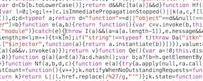

---
#  Chrome Dev Tools and Debugging JS (# mins)

| Timing | Type | Topic |
| --- | --- | --- |
| x min | [Introduction](assets/#introduction) | Topic |
| x min | [Demo/Codealong](assets/#demo) | Topic |
| x min | [Guided Practice](assets/#guided-practice) | Topic |
| x min | [Independent Practice](assets/#ind-practice) | Topic |
| x min | [Conclusion](assets/#conclusion) |Topic |

### LEARNING OBJECTIVES
*After this lesson, you will be able to:*

- Identify and resolve common and uncommon "logical errors" that affect the results of your program.
-  Use logs to troubleshoot errors in an application.
- Conduct real-time debugging in the browser.
- Differentiate between syntax, reference, and type errors.

### STUDENT PRE-WORK
*Before this lesson, you should already be able to:*
- Describe some concept
- Explain how to do something
- Do or build something

### INSTRUCTOR PREP
*Before this lesson, instructors will need to:*
- Gather materials needed for class
- Complete Prep work required
- Prepare any specific instructions

---
<a name="opening"></a>
## Opening (# mins)
- Review pre-work, projects, or exit ticket, if applicable
- Review current lesson objectives
- Reference general course content or topics (e.g. code or concepts that have been used across multiple lessons)
- Include Hook / Real-world Relevance (why the content from this lesson is useful or important)

> Instructor Note: Use instructor notes to talk directly to instructors. Otherwise, write out lesson directions and materials in a student-facing voice.

Check: Ask students to define, explain, or recall any **general** prior concepts or tools.

***
# JS Debugging

## Learning Objectives

* Identify and resolve common and uncommon "logical errors" that affect the results of your program.
* Use logs to troubleshoot errors in an application.
* Conduct real-time debugging in the browser.
* Differentiate between Syntax, Reference, and Type errors.

## Framing

This class is about Javascript errors and what to do when you get one.

<details>
 <summary>What does it mean to have an error in JS?</summary>
  <br>

  Errors don't just happen. Chrome doesn't just "break". In fact, it's not Chrome that's throwing the error at all: it's Javascript.

  Whenever you run into an error, it's because somewhere in the code you're running or in Javascript's source code there's a line that says, "When this happens, throw an error."

</details>

## What's an Error?

Let's see how to throw an error.

Here's a piece of HTML/JS that "throws" an error...

```html
<!DOCTYPE html>
<html>
  <head>
    <title>JS Errors</title>
    <script>
    throw(new Error("Oh, noes."));
    console.log("Such is life.");
    </script>
  </head>
  <body></body>
</html>
```

The result:

```
Uncaught Error: Oh, noes.       index.html:6
```

The `console.log` doesn't happen.

> **Note**: Don't worry too much about the syntax of how to throw an error, you won't be creating your own custom Errors very often in this class, we're just showing this to you so you know what "magic" is going on under the surface.

## Common Errors

Now that we know a little bit about what an Error is and when it is thrown, let's look at some of the most common errors that you will run into in JS.

### You-Do: Encountering Common Errors in JS

Take 5 minutes to independently work through this exercise by fixing the following JS snippets:

1.

```js
var myString = "awesome";

function printString (str) {
  console.log(str);
}

printString(str);
```

2.

```js
var total = 0;

var cashRegister = {
  addToTotal: function (amount) {
    return total + amount;
  }
}

total = cashRegister.add(4);
```

3.

```js
function shoutLongWords (word) {
  if (word.length > 5)
    console.log(word.toUpperCase());
  } else {
    console.log(word)
  }
}
```

## Reading Error Messages

Javascript has [7 error types](https://developer.mozilla.org/en-US/docs/Web/JavaScript/Reference/Global_Objects/Error#Error_types). 3 of them will account for 99% of the errors you encounter in this class, so we're going to focus on those.

<details>

  <summary><strong>Q. What might these 3 words mean in the context of Javascript? <i>Syntax</i>, <i>reference</i>, and <i>type</i>.</strong></summary>

  > Syntax: The way the code is actually written.

  > Reference: The process of calling variables and functions.

  > Type: The different kinds of data Javascript can handle, like strings and numbers.

</details>
<br/>

## Tools for Debugging

> **Note**: If the `"Preserve log"` checkbox is checked in your Chrome console, uncheck it. When it's checked it doesn't clear error messages when you refresh your page. This can make your console get *really* ugly *really* quickly.

### Reading Error Messages

Let's say I get this error message:

```
Uncaught SyntaxError: Unexpected token {      controller.js:8
```

<details>

  <summary><strong>Q. In what file and on what line is the error?</strong></summary>

  > Line 8 of `controller.js`

</details>
</br>

Click on `controller.js:8` and it'll show you that specific line of code.

### `console.log`-ing

More often than not, Errors are usually caused by some variable not having the value you expect. The easiest way to debug code is to see how the value of a variable changes over time. The easiest way to do *this* is with `console.log`.

A quick and widely used way to debug errors is to put `console.log` statements everywhere. From there, we look for the place a variable stops having the value we expect it to have. That's where the error is.

Lets see this in action, by taking a quick look at a code example.

#### I Do: Debug [TTMAR](https://github.com/ga-wdi-exercises/ttmar/tree/wdi12-inclass)

> **Note**: No need to clone, just follow along with the instructor on the board.

Currently, we have a lot of code written in `app.js`, but our solution is still not functioning correctly.
Let's put some `console.log` statements in our code to make sure that our values are what we think they are.

---

## Debugger

An alternative to using `console.log` is to use the debugger capabilities of your browser. Modern browsers come with the ability to set a breakpoint on a specific line of your code. This will cause the execution of the program to pause every time the line with the breakpoint is reached and allow you to inspect the values of variables at that point.

`debugger` stops a script at its line of code and lets you "look around". You can see what variables are available at the line of code where `debugger;` is run.

To make your code continue, press the little eject-looking button.


You can have as many `debugger;` lines as you want. The script will stop at each one and wait for you to tell it to continue.

# How To Find Answers (15 minutes / 2:15)

If you can't fix an error within a reasonable amount of time &mdash; for instance, if the console says the error's on a line like this...



...turn to Google. Definitely do NOT try to slog through minified code.

## Google Fu

Let's say we get the following error in the console...

```bash
Uncaught ReferenceError: robins_spatula is not defined
```

<details>
  <summary><strong>Q. How should we go about Googling a solution to this error?</strong></summary>
  <br/>

  * Copy and paste the exact text of your error into Google, and then remove any words that are specific to your script.
    * For example, instead of:
    ```
    Uncaught ReferenceError: robins_spatula is not defined
    ```
    ...search for:
    ```
    Uncaught ReferenceError: is not defined
    ```

  * If you're looking for a specific phrase, put it in quotes.
    * `is not defined` will return any page with the words `is`, `not`, and `defined`.
    * `"is not defined"` will return any page with the exact phrase `is not defined`.


  * Use `-` to exclude stuff.
    * `ReferenceError -jquery` will return any page with `ReferenceError` and **without** `jquery`


  * Use `site:sitename.com` to search within a site
    * `site:stackoverflow.com ReferenceError` will search for pages with `ReferenceError` inside Stack Overflow only

</details>

## Stack Overflow

When the instructors look at things on Stack Overflow, we tend not to read the actual content of the question; we skip straight to the answers.

If the answer doesn't look promising, go to the next one. Repeat until the answers have very few upvotes.

If none of the answers are promising, go on to the next thing that turned up on Google.

You can get [badges](assets/stackoverflow.com/help/badges) and [special privileges](assets/stackoverflow.com/help/privileges) on Stack Overflow by asking good questions and giving good answers!


## Independent Practice

<!--

SME NEEDED (30 - 45 min estimated to build out lab)

- The current lab for this lesson has students practicing debugging using the Divided Times, incorporating the DOM which students haven't practiced yet. 

It would be great to have an exercise here that has students practice debugging the following that students have learned:

- Variables / Data Types
- Arrays 
- Loops *** Could be super helpful!
- Objects

One idea is to have a js project with some errors and students need to open it in Chrome and debug it using only dev tools. I would emphasize - no scanning through the JS file for errors! You need to use the Dev Tools to figure out what's wrong.

For further context, the objectives for this lesson are: 

- Identify and resolve common and uncommon "logical errors" that affect the results of your program.
-  Use logs to troubleshoot errors in an application.
- Conduct real-time debugging in the browser.
- Differentiate between syntax, reference, and type errors.

-->

***

<a name="conclusion"></a>
## Conclusion (# mins)
- Review independent practice deliverable(s)
- Recap topic(s) covered in today's lesson
- Cover homework and/or upcoming tasks

***


### ADDITIONAL RESOURCES
- Exercises
- Videos
  * WDI8 Screencasts
    * [Part 1](https://youtu.be/dCukspxmNDs)
    * [Part 2](https://youtu.be/VbfB1qB20Yk)
- Readings
	- [Debugging in JS](http://eloquentjavascript.net/08_error.html)
- Decks

> Instructor Note: When possible, provide a brief description of Additional Resources, classifying whether it is for advanced or beginner students.  

